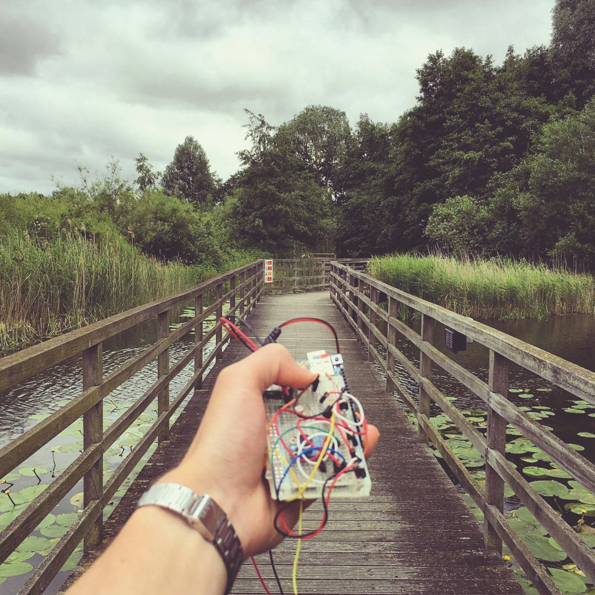
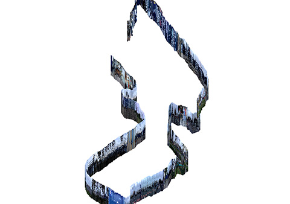

# Assignment 00: Course Project - *Mapping Urban Media*

- [Assignment 00: Course Project - *Mapping Urban Media*](#assignment-00-course-project---mapping-urban-media)
  - [Brief](#brief)
  - [Background](#background)
  - [Mapping Urban Media](#mapping-urban-media)
  - [Overview](#overview)
    - [Option 1: Field Work](#option-1-field-work)
    - [Option 2: Remote Sensing](#option-2-remote-sensing)
  - [Requirements](#requirements)
  - [References](#references)
  - [FAQ](#faq)
    - [Can I change my selected urban media focus after week 1?](#can-i-change-my-selected-urban-media-focus-after-week-1)

## Brief

Your final project for this course starts now, at week 1. Everything that you do in this course - every assignment and reading - will be in service of shaping a final, cohesive work. The course project for this 7-week semester is themed: *Mapping Urban Media*.

There will be a total of 5 assignments this semester that are designed to help you generate the touch points of your final work. Each of the assignments are designed to help you unpack what it means to be *mapping urban media*. 

You will use the assignments as prompts to support what scholar Shannon Mattern calls, an **urban media archaeology** ([1](#)[2](#)). You will attempt to understand and communicate about one super specific aspect of urban media - some feature of infrastructure - and its relations to a broader geographic, environmental, political, media, and historical context. Through the process of simultaneously researching and creating work about the urban media of your choice, you will document and catalog your discoveries about *what you've come to know and understand about your urban phenomenon*. Furthermore you will help to unpack what social, cultural, political, and environmental processes and histories are/have been at play in shaping your urban media and vice versa. 

The result of this exercise will be the production of a body of work that uses mapping and maps and to inform your understanding the geography of your selected urban media. Upon the submission of your final work, your findings will be published as part of a [class zine](https://github.com/joeyklee/all-maps-lie-2020-zine). 

## Background

| | |
|:-- | --|
| |  | 

In 2017, David Hunter and his students published a project called "[Data Walking](http://datawalking.com/)", which is described as a "research project exploring environmental data gathering & data visualisation." The outcomes of this exploration were a set of tools, methods, data, and visualizations and maps. For David and his students, the process of making environmental observations around their neighborhood in North Greenwich and mapping them with DIY hardware and software provided profound reflections around ways in which data and visualizations are both shaped by and shape the urban environment. 

Several years earlier, Rob Walker in 2014 started asking his students to "[practice paying attention](https://medium.com/re-form/how-to-pay-attention-4751adb53cb6)." Rob was concerned about the ways in which our current media were preventing us from "seeing." In fact his practice of paying attention was even framed as a "war against seeing." To do this, he asked his students to focus on one specific element or phenomenon in his students' daily lives. Students were tasked with creating a seemingly simple prompt and following that prompt in such a way they helped them identify something that might be considered mundane or trivial. By creating self-assigned briefs to notice the world around them, students trained themselves to see things that they might have otherwise overlooked.

More recently, Jenny Odell published her book [How to Nothing: Resisting the Attention Economy](https://medium.com/@the_jennitaur/how-to-do-nothing-57e100f59bbb) in which she argues that our attention is central to our ability to form communities, extend care towards others and the environment, and to find the will/courage/energy to *do something* about the systems and structures that try to oppress, control, distract, commodify, and marginalize us. Jenny illustrates the ways in which paying attention is something that requires constant intention and practice. 

These works highlight examples of projects that in one shape or another require focusing one's attention on *some thing*, learning about that thing, and trying to center that thing in a deeper way. These examples engage critically to varying degrees with the different politics, media, and geography and offer tangible material for us to see something new or to draw previously unconnected lines in our consciousness. 

Similarly, scholars like [Shannon Mattern](http://wordsinspace.net/shannon/about/) and [Jeremy Crampton](https://www.ncl.ac.uk/apl/staff/profile/jeremycramptonnewcastleacuk.html#background) are asking questions about the world - about power, infrastructure, and politics - through the lens of different media and geographies and proposing methodologies and frameworks through which we might better understand society, culture, and space. What these more academic contributions offer is a set of conceptual frameworks and methodological tools to really unpack context, history, and the geography of the things that are interesting and important in our lives.

Drawing inspiration and methodologies from these varying worlds - from critical cartography to urban media archaeology and media art to creative technology - we will embark on understanding *what mapping means*, *what mapping does*, and *what our role as cartographic outsiders is in shaping spatial thinking*. Taking the lessons from David, Rob, and Jenny, we will practice paying attention through intentional (small) data collection and mapping efforts. Drawing inspiration from scholars like Shannon and Jeremy, we will practice researching and writing about *things* - their form, their materiality, their histories, and their geographies, and their politics. Taken together, we will practice our skills as researchers and makers of spatial media. 

## Mapping Urban Media

What is *urban media*? In the context of this course and this project briefing, we can consider *urban media* as any kind of infrastructure - natural or built, static or interactive - that exists in urban space. The size of these urban media can range - e.g. fire hydrants vs. street tree vs. bus shelters vs. telephone poles - as well as the spatial scale - e.g. street level vs. block level vs. neighborhood level - that may be relevant for best understanding your selected urban media. 

The key constraint here is that **you must be able to photograph or document individual instances** of that urban feature whether in person (with your camera phone) or remotely (e.g. aerial images, street view, or found images from the web or social media). 

Additional constraints:
* These media should be accessible in your daily life in one way or another.
  * For example: **It makes sense to** map the door hinges you pass through vs. **it does not make sense to** try and map the birds in Prospect Park (unless you go birding every day).

Some urban media that would be fair game:
* Fire hydrants
* Manhole covers
* Shop signs 
* Link NYC kiosks
* Bus Shelters
* Street Trees
* Security Cameras
* Cracks in the sidewalk
* Empty tree beds (Joey will be doing this!)
* Graffiti

Notice how these are all things that you might encounter every day on your commutes, on walks to the grocery store, in Google Streetview, or while walking your dog. 

## Overview

<s>There are **two options** for structuring your urban media mapping project, one that is more "field work" based and the other that is more "remote sensing" based. Both options will require you to *pay attention* to some kind of urban phenomenon. Both options will challenge you to dig deep into the *processes, histories, and politics* that have shaped your focal point. </s>

For your projects this semester, you will be exploring "urban media" through the lens of Google Streetview and other geospatial data. In exploring Streetview, each of you will focus on **one** aspect of urban space. The project will challenge you to dig deep into the *processes, histories, and politics* that have shaped your subject of interest as well as prompt you to question the ways in which Google Streetview shapes what you can know about your subject of interest.

NOTE: I acknowledge that Streetview does place a number of constraints on our mapping abilities and offers a very specific lens of *seeing*, however, those constraints and lenses are also opportunities for practicing important data awarenesses such as understanding sampling bias, temporal bias, data licensing and so on.

A successful project will:
1. **Showcase substantial effort and thoughtfulness in data collection and mapping**
   - **Quality**: Was your data collection done in a meticulous, rigorous, and/or careful manner? Was your data well organized? 
   - **Understanding**: Based on your collected data and documentation, was it clear that your mapping efforts were done thoughtfully. Your data collection should engage critical themes mentioned or discussed in the class such as those around ethics, privacy, social/environmental justice, feminism, power, race, etc. 
   - **Application**: More data is not necessarily better. What is important is that your collection is substantial and/or substantive to provide materials for discussion. Ultimately: were your collection methods appropriately applied?
2. **Educate your peers**
   - **Quality**: Did you make enough effort to synthesize and summarize your work such that others can engage with your focal point?
   - **Understanding**: Were you able to successfully synthesize and summarize your findings? 
   - **Application**: Were you able to create, collect, and make sense of materials - in the form of your projects and primary and secondary research - in coherent and appropriate manner?
3. **Surprise and delight**
   - **Quality**: Did you make an effort to prepare your materials in a manner that expresses care for how your peers and audience will experience your research?
   - **Understanding**: Did you engage with your focal point enough to arrive at potentially new perspectives? 
   - **Application**: Did you go beyond the given code examples? Did you inject your personality or style into the work in any way? 

These three criteria for evaluation should help inform you along the way. Please make sure to refer back to this through out the duration of the project. 

<s>Below are the two options/tracks for project development:</s>
Below you will find a general schedule for the final project development:

<s>
### Option 1: Field Work

NOTE: Given the need for remote class work and social-isolation during the coronavirus pandemic we may rework the mechanisms and methods of "data collection." As your instructor, I cannot in good conscience or by mandate of the University assign work that would otherwise endanger you. Therefore, please see **option 2**.

**Option 1** is your "field work" option/track. In this option you will do data collection by directly mapping your selected urban media in-person, out in the world. 

* Week 1: 
  * Begin data collection: mapping an element of urban media
  * Begin your [urban media archaeology](https://en.wikipedia.org/wiki/Media_archaeology) →  
* Week 2: 
  * Create a web map which displays the data you've been collecting
  * Continue your media research and 
  * Continue data collection → 
* Week 3: 
  * Begin looking at other ways of understanding the spatial context of your urban media through spatial abstraction and/or supplemental data, 
  * Continue your media research and 
  * Continue data collection → 
* Week 4:
  * Use aerial imagery and streetview imagery to work through 
  * Continue your media research and 
  * Continue data collection → 
* Week 5:
  * Build a narrative that orients us physically in space
  * Continue your media research and 
  * Conclude data collection →
* Week 6:
  * Document and synthesize your "urban media" mapping for submission.
  * Teach your classmates something new.  
</s>

### Option 2: Remote Sensing

NOTE: Given the need for remote class work and social-isolation during the coronavirus pandemic we may rework the mechanisms and methods of "data collection." As your instructor, I cannot in good conscience or by mandate of the University assign work that would otherwise endanger you. 

**Option 2** is our "remote sensing" option/track. In this option you will do data collection remotely by mapping your selected urban media using secondary sources such as found data, images, videos, and 3rd-party APIs and services. 

* Week 1: 
  * Begin data collection: mapping an element of urban media using aerial imagery and street view
  * begin your [urban media archaeology](https://en.wikipedia.org/wiki/Media_archaeology) →  
* Week 2: 
  * Create a web map which displays the data you've been collecting
  * Continue your media research and 
  * Continue data collection → 
* Week 3: 
  * Begin looking at other ways of understanding the spatial context of your urban media through spatial abstraction and/or supplemental data, 
  * Continue your media research and 
  * Continue data collection → 
* Week 4:
  * Use aerial imagery and streetview imagery to work through 
  * Continue your media research and 
  * Continue data collection → 
* Week 5:
  * Build a narrative that orients us physically in space
  * Continue your media research and 
  * Conclude data collection →
* Week 6:
  * Document and synthesize your "urban media" mapping for submission.
  * Teach your classmates something new. 

## Requirements

| ☑️ | Requirement | Description |
| :--- | -------- | ----------- |
| ☑️ | Data Submission | You must submit the data you collected to a centralized repository. Your data - images and otherwise - must be [well documented](../guides/data-documentation-guide.md)! |
| ☑️ | Content Submission | You must submit your research in a coherent form as specified in the [Zine submission guide](../guides/zine-submission-guide.md) if you want your work to be included in the class zine. |
| ☑️ | Blog posts and reflections | You will be documenting your learning through your blogs. A submission indexing all of your posts will be required. |

## References

* See [Bibliograhpy](../BIBLIOGRAPHY.md)

## FAQ

### Can I change my selected urban media focus after week 1?
+ No. You may not. The lesson here is that you can find beauty/complexity/history/fascination with almost anything and it is your challenge to discover those things and bring them to light. Something about that initial prompt intrigued you, you'll have to work through the "trough of disillusionment!"

