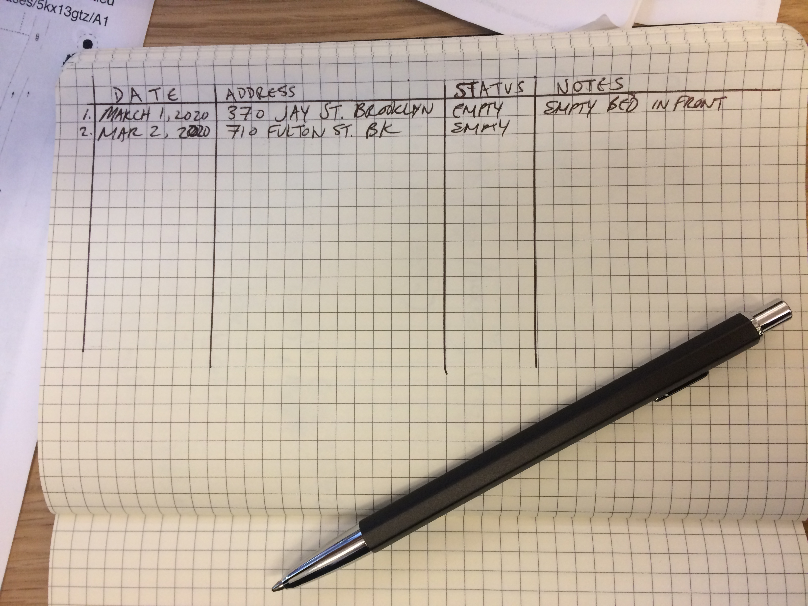
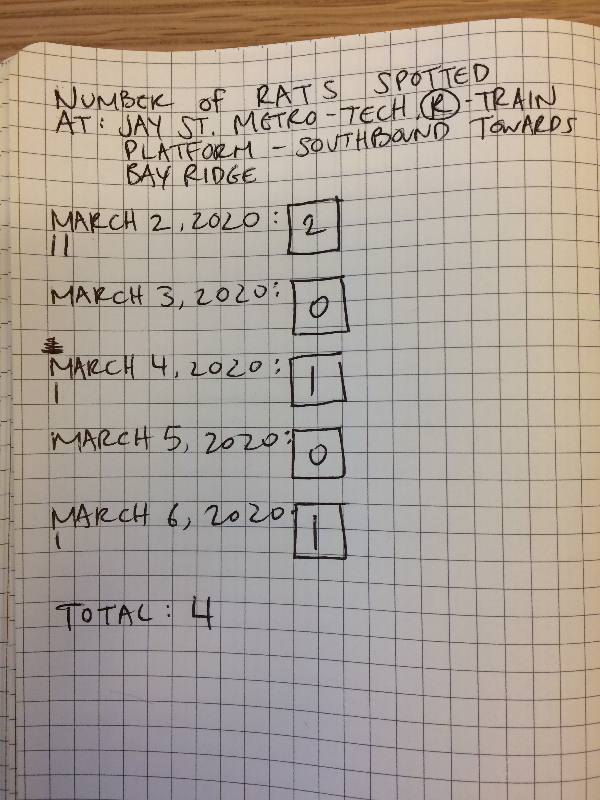

# Analog Data Collection Guide

## DATA COLLECTION

### Structuring your "database" and adding entries:

#### Table structure
Probably the most important thing here is structuring your "database" or the place where you are planning to track your data (e.g. your notebook or flashcard). 

Let's say I wanted to collect data about every empty tree bed in NYC in my notebook with pen and paper, then I'd probably structure my data like this:

| date| address | status | notes|
| :-----| ----- | -----| -----|
| March 1, 2020| 370 Jay St., Brooklyn | empty | empty tree bed in front of building |
| March 2, 2020| 710 Fulton St, Brooklyn | empty | recently destroyed tree |

My notebook would look like this:

* give yourself ample space to write!

This is a handy way of structuring your data collection in a way that can easily be digitized or allow you to count or "check-off" data from your sheet. 

#### Counting

An even more simple method would be something like taking counts of a phenomenon of interest on a notecard. In this case, you might imagine constraining your spatial location and time period.

#### Other possibilities?

Can you imagine other possibilities for analog or lo-tech data collection methods?

## DATA PROCESSING

* **Analog processing**:
  * Analog methods of data processing include hand-drawn charts, graphics, and tables. These will likely be summaries of your data in one way or another that express counts, percentages, minimums, maximums, averages, medians, and other summary statistics.
  * An overview of methods are shown here on the [Citizen Statistician blog](http://www.citizen-statistician.org/2017/10/hand-drawn-data-visualizations/)
    * On the more literal side: [Hand Drawn Info graphics](http://www.lindseypoulter.com/2018/12/20/my-2018-a-hand-drawn-data-viz/) and [Mapping Manhattan](https://www.brainpickings.org/2013/04/02/mapping-manhattan-becky-cooper/)
    * On the more artistic side: [Dear Data](https://www.dear-data.com/theproject)
* **Digitize and process**:
  * add your data using a spreadsheet program like Google Sheets, Excel, Numbers, or OpenOffice.
  * If you are using a spreadsheet software, ALWAYS structure your data with in the format with columns and rows, where:
    * Columns: 
      * These define the individual properties of your data
    * Rows: 
      * Each individual entry 
  * If you have missing data you can use NULL or -9999 as a way to indicate that your data are missing.

## REFERENCES

* [Hand Drawn Info graphics](http://www.lindseypoulter.com/2018/12/20/my-2018-a-hand-drawn-data-viz/)
* [Mapping Manhattan](https://www.brainpickings.org/2013/04/02/mapping-manhattan-becky-cooper/)
* [Dear Data](https://www.dear-data.com/theproject)
* [Fundamentals of Data Visualization, C. Wilke](https://github.com/clauswilke/dataviz)