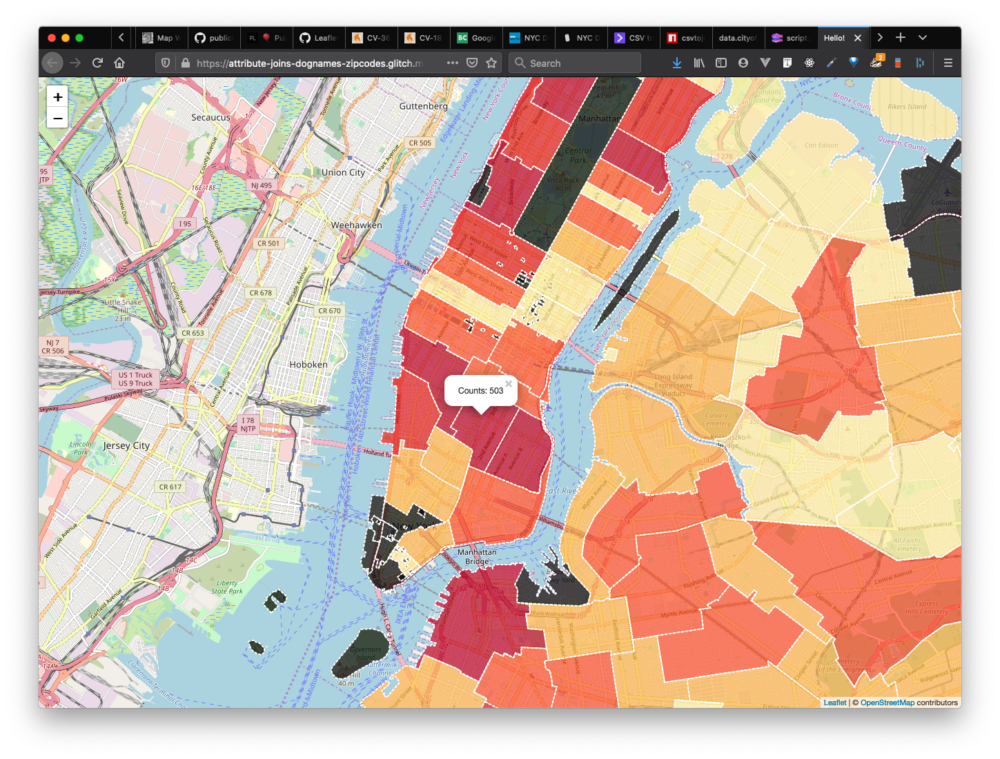

# Attribute Joins Guide

Attribute joins are a useful data handling skill for any purpose, but they are of specific significance for handling spatial data because it can allow you to take attributes from a dataset without geographic coordinates and join them onto data with spatial coordinates so they can be mapped. 

## Audience

This guide will assume some working knowledge of JavaScript and focus specifically on handling attribute joins between JSON objects.


## NYC Dogs born in 2016




This demo will showcase how to take a dataset without geographic coordinates -- **NYC's dataset of dogs** born in 2016 -- and merge those data with the administrative boundaries showing **NYC's** ZIP code boundaries.

→ See the demo here: [Demo in Glitch - Attribute Join Map](https://glitch.com/edit/#!/attribute-joins-dognames-zipcodes)


### Data

The Joining Data based on a common field which is "zip code". You'll notice that the **key** in each dataset varies slightly. In our Dog Licensing dataset we have `ZipCode` whereas in our administrative boundaries we have `ZIPCODE`.

* **NYC_Dog_Licensing_Dataset__birth-2016.json**: A sample of our NYC dog data looks like this:
  ```js
  { RowNumber: "38387", AnimalName: "MILKY", AnimalGender: "M", AnimalBirthMonth: "2016", BreedName: "Chihuahua", Borough: "", ZipCode: "10465", LicenseIssuedDate: "01/14/2016", LicenseExpiredDate: "01/14/2017", "Extract Year": "2016" }
  ```
* **nyc-zipcodes.geojson**: A sample of one of our zip code boundaries looks like this:
  ```js
  {"type":"Feature","properties":{"ZIPCODE":"11436","BLDGZIP":"0","PO_NAME":"Jamaica","POPULATION":18681,"AREA":22699295.4594145,"STATE":"NY","COUNTY":"Queens","ST_FIPS":"36","CTY_FIPS":"081","URL":"http://www.usps.com/","SHAPE_AREA":0,"SHAPE_LEN":0},"geometry":{"type":"MultiPolygon","coordinates":[ `<A BUNCH OF COORDINATES>` ]}}
  ```
Note that `<A BUNCH OF COORDINATES>` should be a bunch of coordinates representing the geometry of each boundary

The goal is to be able to merge the dog licensing data into the administrative boundaries. In the demo linked above, we add a property in our administrative boundaries called `dogData` and `dogDataCount`. The `dogData` property is an array that contains every object in the dog licensing dataset where the zip codes match. The `dogDataCount` counts how many dogs are in the `dogData` array. Here's a sample of what we might expect resulting from this attribute join:
  ```js
  {"type":"Feature","properties":{"ZIPCODE":"11436","BLDGZIP":"0","PO_NAME":"Jamaica","POPULATION":18681,"AREA":22699295.4594145,"STATE":"NY","COUNTY":"Queens","ST_FIPS":"36","CTY_FIPS":"081","URL":"http://www.usps.com/","SHAPE_AREA":0,"SHAPE_LEN":0,"dogData":[{"RowNumber":"86005","AnimalName":"NAME NOT PROVIDED","AnimalGender":"M","AnimalBirthMonth":"2016","BreedName":"Poodle Crossbreed","Borough":"","ZipCode":"11436","LicenseIssuedDate":"08/14/2016","LicenseExpiredDate":"08/14/2017","Extract Year":"2016"},{"RowNumber":"97766","AnimalName":"SNOWBALL","AnimalGender":"F","AnimalBirthMonth":"2016","BreedName":"Havanese","Borough":"","ZipCode":"11436","LicenseIssuedDate":"10/06/2016","LicenseExpiredDate":"10/06/2017","Extract Year":"2016"},{"RowNumber":"104444","AnimalName":"PAC","AnimalGender":"M","AnimalBirthMonth":"2016","BreedName":"Yorkshire Terrier","Borough":"","ZipCode":"11436","LicenseIssuedDate":"11/11/2016","LicenseExpiredDate":"11/11/2017","Extract Year":"2016"}],"dogDataCount":3},"geometry":{"type":"MultiPolygon","coordinates":[ `<A BUNCH OF COORDINATES>` ]}}
  ```

## Using JavaScript to Join Data
There are zillions of ways to do an attribute join, but in this case, if we're using JavaScript, it might look something like the code below. In the case of this example let's break this down in plain English:

> For every geojson feature in the **zipcodeBoundaries.features** array, I want to iterate through every feature. In each iteration I want to return each **geojson feature** with two new properties -- `dogData` and `dogDataCount` -- attached to it's properties object. In each iteration of the `.map()` function, I will filter the **dogData array** and only return the dogs that share the same zip code as in the zip code boundaries data. Once I have added all the dogs to each matching zip code, then I want to count how many dogs have been matched to that zip code. Once both of those tasks have been completed, then I will return the updated geojson feature and then continue on to the next iteration of the `.map()` loop until I've gone through every zip code. 

```js
function joinByZipCode(){
  
  zipcodeBoundaries.features = zipcodeBoundaries.features.map(feature => {
    // add a property called "dogData" and add all the dogs that have the same zip code
    feature.properties.dogData = dogData.filter( dog => Number(dog.ZipCode) == Number(feature.properties.ZIPCODE) );
    
    // store the length of the dogData array in a property called dogDataCount
    feature.properties.dogDataCount = feature.properties.dogData.length;
    
    return feature;
  });
}
```

We have 2 functions here that may be new to you, namely:
* `.map()`
* `.filter()`

You can read more about those functions here:
* [JavaScript Array Functions - .map()](https://github.com/itp-dwd/2020-spring/blob/master/guides/javascript-frontend-guide.md#the-map-function-map-callback-)
* [JavaScript Array Functions - .filter()](https://github.com/itp-dwd/2020-spring/blob/master/guides/javascript-frontend-guide.md#the-filter-function-filter-callback-)


## Next steps

Pretty much that's all there is to it! Attribute joins can get infinitely more complex if your matching attributes aren't 1-to-1 matching -- e.g. if you have to start writing some crazy logic to match strings -- but essentially the process is the same. With two loops and some conditional statements, you can breath some cartographic life into some data that we couldn't otherwise map. 

Some additional considerations:
* We didn't normalize our data -- In this case we're showing dog counts born in 2016. When we render the data on the map, does it make sense to show dogs per square kilometer? or how about dogs per capita? -- Definitely this is important for allowing people to more accurately visually compare different zip codes. 

You might also be interested in learning about [Spatial Joins](guides/turfjs-spatial-joins-guide.md)


