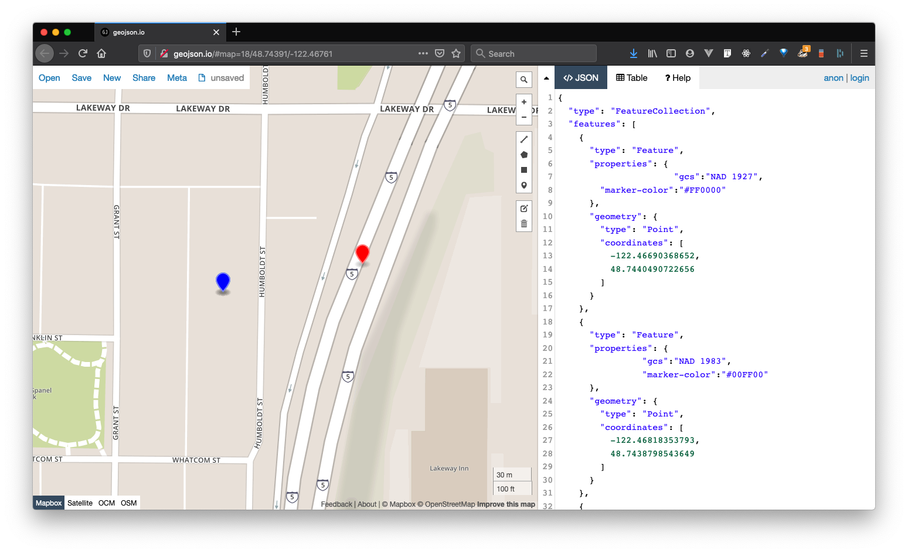

# Geo Intro Guide

- [Geo Intro Guide](#geo-intro-guide)
  - [What does it mean for something to have a location?](#what-does-it-mean-for-something-to-have-a-location)
  - [How do we translate location onto maps?](#how-do-we-translate-location-onto-maps)
    - [Geographic coordinate systems](#geographic-coordinate-systems)
    - [Projections](#projections)
  - [Geographic information systems (GIS)](#geographic-information-systems-gis)
  - [Geographic Data and Geographic Data formats](#geographic-data-and-geographic-data-formats)
    - [Raster](#raster)
    - [Vector](#vector)
  - [(Geographic) data types](#geographic-data-types)
    - [Numeric](#numeric)
    - [Nominal](#nominal)
    - [Ordinal](#ordinal)
  - [Anatomy of a Web Map](#anatomy-of-a-web-map)
  - [Web Mapping Tools](#web-mapping-tools)
    - [Platforms](#platforms)
    - [JavaScript Libraries](#javascript-libraries)
  - [Why all of this matters in the context of All Maps Lie](#why-all-of-this-matters-in-the-context-of-all-maps-lie)
  - [Wrapping Up](#wrapping-up)

This guide focuses on answering three main questions:
1. What does it mean for something to have a location?
2. How do we translate location onto maps?
3. What makes a (web) map?

## What does it mean for something to have a location?

To examine these questions, we start by going back into history. Malcolm Lewis argues in "The Origins of Cartography" that maps are deeply situated in human evolution; *spatialization* being deeply intertwined with human consciousness, thought, and language. From this point of view, we might say that our need and desire to "place ourselves" has been part of human survival and a point of fascination since our beginnings. 

But what does it mean to "place ourselves?" From a spatial perspective, what we are referring to is *where something is located*. Have you ever thought to ask, "what is location?" What does it mean for something to have a location? Furthermore, how to do take something that has location and show where that something is? 

NOTE: Much of this chronology is inspired by this talk ["How Did They Make Those Maps", given by Dr. Robert Karrow on February 13, 2011 at the McClung Museum](https://www.youtube.com/watch?v=wbwmXKwkgaw 
)

For thousands of years, people have have been trying to resolve these questions. By reading into history we can see the myriad ways that philosophy, astronomy, and math have come to shape our understanding of geography. From the ancient number systems of the Babylonians shaping how we count to the celestial maps identifying stars like Polaris (the north star), the summation of human knowledge have been contributing directly (and indirectly) to the ways that we have come to understand *where we are in the world*. 

Some of the first "maps of the world" can be traced back to the ~500BC to the Babylonians and the early Greeks such as Anaximander and Hecataeus, but we will begin our story this week with a particularly influential character named Eratosthenes. Eratosthenes was a Greek scholar in ~200BC whose works are reflected in how we've come to understand and represent location. He is perhaps one of the first to propose the first calculation of the earth's circumference, to calculate the tilt of the earth's axis, and is credited with incorporating the use of parallels (horizontal) and meridians (vertical) lines to divide a map such that the relative distances between places could now be more easily linked (this is a massive thing!). Eratosthenes's Geography was more than just clever experiments to prove his assertions about earth's spherical shape and it's size, but also reflected an understanding of where things might be located as a function of the reported daylight hours of a place. This would come to inform what we now call, latitude--the north/south location on earth. Eratosthenes's work was further developed by another fellow Greek by the name of Hipparchus (~BC120) who sought to create more accurate ways of deriving latitude and established early ideas around the relationship between time and place for deriving a location from east to west. This was the beginnings of an understanding of *longitude*. 

Central to the development of understandings of "where" things were in the world came from examining the works and records of the civilizations and empires of the past. Fast forward ~100 years and the Roman Empire had expanded across much of what is now known today as Europe and North Africa. The Romans kept extensive records of "where" things were, the "Milliarium Aureum" being a symbol and marking point from which all distances were measured. The saying "all roads lead to Rome" is associated with this marker. What is significant about the Milliarium Aureum is that it marked a stable location relative to which distances could be measured and, with such an extensive empire, a phenomenal "dataset" from which maps of the world could be made. Enter Ptolemy. 

Ptolemy, a Greek Scholar living in Alexandria ~150AD, was a rather keen data collector. In his *Geography* he created an extensive Gazette of the locations of the Roman Empire along with other known locations. Using this he created instructions of how to create maps of the world, using latitude (*climata*, as a function of daylight hours) and longitude (as a function of time, based at what he defined as 0 degrees located over Fortunate Isles rather than those that had been done previously by geographers like Eratosthenes and Hipparchus, which were centered roughly around Alexandria) in coordinate degrees. Despite the blank spots on the map, we can see the beginnings of the cartographic systems and conventions being made! Ptolemy is also known to be one of the first to record observations of the Polaris (the North Star) which is important for our understanding of latitude.

However erroneous these maps may have been, the contributions of these early scholars to positional awareness were central to the establishment of mapping, cartography, and exploration. Fast forward over a thousand years, particularly to the Age of Discovery (starting ~1400s). Maritime exploration, colonization, and global trade was happening like never before. New map projections like Gerardus Mercator's, Mercator projection, allowed for less precarious nautical travel -- by preserving angular direction, as long as sailors could keep at a constant direction, they would make it to their destination -- and new sailing technology made long maritime travel faster. Increasingly more places were being "put on the map" and with inventions like the marine chronometer (late 1700s) invented by John Harrison, travelers could now accurately determine longitude at any time and place also allowing people to correct inaccuracies in previously mapped locations.

By the 1800s -- long before satellite GPS -- there were now ways to accurately locate places on earth. The prime meridian had been set by the British at Greenwich, UK which set the (arbitrary) global standard for 0° longitude and  0° latitude was defined (less arbitrarily you can say) at the equator. With a set 0°,0° and with accurate chronometers that could keep accurate time with Greenwich, UK, the world now could express location--where something is--better than ever before. By extension things could be mapped better than ever. What did it look like to put a place on a map? The answer to this is simply: with a lot of work... and surveying!

Cartographic data collection is knowing about where things are. As we saw with how we measure longitude, knowing *where something is* means knowing *where something is relative to something else*, usually a fixed location and time. By looking at the early surveying tools such as the [Gunter Chain](https://en.wikipedia.org/wiki/Gunter%27s_chain) and [surveyor's compass](https://en.wikipedia.org/wiki/Surveying), you can see that with relatively simple tools, you can produce detailed spatial data and as a result, detailed maps; maps of the [Great Lakes]() and the [Great Trigonometrical Survey of India](https://en.wikipedia.org/wiki/Great_Trigonometrical_Survey) are great examples of these tools and methods in action. Now with locational technologies such as [satellite GPS](https://www.youtube.com/watch?v=FU_pY2sTwTA) in conjunction with tools like [wifi sensing](https://slate.com/technology/2018/06/how-google-uses-wi-fi-networks-to-figure-out-your-exact-location.html) and [bluetooth locations tracking](https://electronics.howstuffworks.com/bluetooth-surveillance2.htm) there are many ways to locate things in the world. However, much of the geographic data we collect isn't just about location anymore. The most interesting things arise when we start to look at geographic data that have more to say about where things are, but rather what is happening and where they are happening. 

The next section takes a closer look at what it means to use location data to produce maps and review some fundamental concepts to understand what makes a map. 

## How do we translate location onto maps?

In the previous section, I gave a (rough) overview of what it has meant to locate things. As a quick review:
1. throughout history, people have long tried to understand where things are in the world,
2. we tell where something is by coordinates expressed as latitude (where we are north or south of the equator) and longitude (where were are east or west of the prime meridian),
3. the tools to locate things are relatively simple, and
4. lastly, knowing where things are is helpful for navigation and for reference, but there's a lot more we can learn from geographic data.

<!-- We learned about how location was determined and derived over the centuries -- with math -- and how location is derived now -- with satellite GPS. To say the least, it is all very impressive.  
-->

So, I think it is safe to say the earth is round. Actually, it is more safe to say that the earth is round-ish. Let's take that even further. The most correct thing we can say is that the earth is a blobby, round **geoid**. According to wikipedia, "The geoid is the shape that the ocean surface would take under the influence of the gravity and rotation of Earth alone, if other influences such as winds and tides were absent. This surface is extended through the continents." [Geoid](https://en.wikipedia.org/wiki/Geoid). The earth is actually really funky looking and it turns out that this is actually really important for our understanding of where things are located and where things eventually get rendered on a a map. Here's why:

1. **Regarding positional accuracy**: all of the fancy math that those old Greeks worked out back then didn't factor in the earth's blobbiness. If we really want to get super accurate with location, then we need to have an accurate model of the earth's blobbiness -- the geoid. Because geoids are super complex to determine location, what we end up using is what is known as a reference ellipsoid (aka reference spheroid or datum). 
3. **Regarding translating a 3D world into 2D**: Taking a 3D spheroid thing and flattening it onto a 2D plane is actually really hard. What map makers like Gerardus Mercator worked out was what is called **projection** or a mathematical way to translate a 3D world (not a geoid, but a spherical ellipsoid) onto a 2D plane by introducing distortions to either angular direction, area, and/or location. Have you ever tried to peel an orange in one piece? Projections offer a way to flatten a 3D thing so it can be represented in 2D. 

### Geographic coordinate systems 

The first point to understand when putting something on a map is to account for the reference ellipsoid (aka reference spheroid or datum) on which the locational data was based on. As noted in this reference post, ["The geoid, ellipsoid, spheroid, and datum, and how they are related"](https://desktop.arcgis.com/en/arcmap/10.3/guide-books/map-projections/about-the-geoid-ellipsoid-spheroid-and-datum-and-h.htm), you can see how positional accuracy can vary depending on which reference ellipsoid was used. Different GCS exist as a way of prioritizing locational accuracy depending on the context that your geographic data will be relevant. For example if you're striving for the most positional accuracy and you're in North America, you might use the NAD83 GCS over the WGS84 GCS which is more globally accurate. Similarly if you are in Australia, you might use GDA94 which is more accurate for Australia over the WGS84.

It is super important to keep track of what reference ellipsoid your various data collection devices (e.g. GPS) and data sources are based on when making projects with geographic data. As you can see in the screenshot below, these positional inaccuracies can lead to false conclusions about where things are located. 

Luckily for us, modern technology coupled with some really smart and clever contributions from geographers (in their many shapes and forms) make it relatively simple to translate between reference systems in case you realize that your data are based on different coordinate reference systems.

### Projections

So you've you've made sure all your data are aligned correctly based on the GCSs of your data, how do you get this 3D world onto a 2D map? Well, it's time to choose a projection. Before we choose a projection though, let's take a second to understand what a projection is and how it works.

As I mentioned earlier, in order to make a map -- that is, translating a 3D sphere onto a 2D plane -- you have to do project your data. A projection is "a complex mathematical method of representing our three dimensional earth in a flat, two dimensional context". Projections preserve EITHER direction (angles), size (area), or distance. There are 3 types of projections named based on what aspect they preserve:
1. **conformal**: preserves angles - the relative angles at all points of the map are correct
  + e.g. mercator projection, 1569
2. **equal area**: preserves area by compromising scale, angles, and shape
  + e.g. Mollweide projection, 1805
3. **equidistant**: preserves the distance between 2 specific points on the map
  + e.g. Azimuthal projection, ~11th century

There are a number of map projections. Dozens actually! You can see them all in action here [D3 Map projection showcase](https://bl.ocks.org/mbostock/29cddc0006f8b98eff12e60dd08f59a7). 

Some map projections like the [Robinson projection](https://en.wikipedia.org/wiki/Robinson_projection) attempt to "compromise" on all those aspects of area and angles. Depending on your take on things, this is either a good thing because it spreads the error "equally" as much as possible or a rather bad thing in that nothing about the map is right in the end. 

Map projections are incredibly important! They pretty much lie at the heart of what it means to represent geography. You can see accidental geographic misrepresentations all over the place where the uses of projections mislead map readers. Sometimes the use of inappropriate projections are not accidental but rather chosen specifically for political purposes to intentionally mislead map readers. Either way map projections are one of the most important considerations to take into account when making a map. 

Map projections are complex math that get applied onto geometry. Figuring out all this math is exciting and super cool, but it is *very* complex and not for the faint of hearted. Lucky or us many smart people exist in the world and have worked out all of these mathematical transformations for us. All we need to do is know how to use them, when to use them, and where (in which software) we can use them. This is where geographic information systems (aka GIS) come in handy!

## Geographic information systems (GIS)

A GIS is a system of managing, analyzing, and rendering, geographic data. GISystems are more than just software--including everything including people, methods, data, and hardware--but for the purpose of this post I will focus on the software aspects.

GISs allow us to handle everything we've talked about so far from geographic coordinate systems to the many projections that allow for geographic data to be analyzed and rendered.

**GIS allows us to manage geographic data**: Managing geographic data means handling many different spatial data formats (we'll talk about this below) and allowing for coordinate system and projection conversions to be done.

**GIS allows us to do geographic analysis**: Geographic analysis is spatial--where things are--and geometric. To do spatial analysis, often times were not only looking to see where things are, but we also need to know how things are interacting. With GIS we can answer how things intersect or overlap or what occurs if spatial elements are added or subtracted and more. 

**GIS allows us to render geographic data**: Not all GIS have methods for rendering, but many/most of them do. Rendering geographic data means knowing how projection information is applied to geographic coordinates to represent those data on some kind of canvas. Usually you can export data to images or PDFs or other similar formats. 

There are many GIS softwares out there ranging from commercial, proprietary solutions like ESRI's ArcGIS to more open source solutions like QGIS or GrassGIS. These software are based on many of the same fundamental software libraries such as GDAL/OGR, PROJ, Mapnik, and GEOS which provide computational solutions to projections, rendering, and data management. 

## Geographic Data and Geographic Data formats

Geographic data can be collected and stored in two high level categories: as vector data or as raster data. 

### Raster

Tom MacWright explains [Raster Data](https://mapschool.io/#data) as:
> data is like a picture that you would take with a digital camera: at the lowest level of abstraction, it is a list of pixels with values. When you ‘zoom in’ and look closer at raster data, at some point you’ll see these discrete pixels, and it will look pixelated.
> 
> Raster data is used in pictures of the Earth, like those taken by satellites - but that is just the beginning. Pixels don’t need to have colors - instead, each pixel can have a number that represents height and the raster data as a whole stores elevation data. Or pixels can store temperature or reflection data and be useful for environmental work.
> ...
> Internally, raster data formats manage two tasks - packing data into pixels, and then storing the relationship between those pixels and actual places on the globe - the ‘extent’ of the data.

Raster Data formats include: GeoTIFF and JPEG2000 

So if a pixel represents geography, then this means that a pixel represents a raster data's **spatial resolution**. What determines spatial resolution for raster data? A number of factors can determine size of a raster's pixels. For aerial imagery and other earth observation applications, the resolution of a raster's pixels (aka cells) is based on the sensor that is doing the imaging and/or remote sensing. You can see that, for example the Landsat 8 Satellite has a resolution of 30mx30m while the MODIS satellite has a min resolution of 250mx250m. These resolutions were thoughtfully and carefully designed and determined based on the needs of each of these satellites' missions.

For the case of raster data that outputs of geostatistical models--e.g. Digital Elevation Models (DEM) or thematic landcover classification maps--then a raster's pixel size may be determined by any number of considerations including data processing power (e.g. high resolution rasters are more computationally expensive), the size of the features that are being resolved (general rule of thumb is that your feature must be at least twice as big as your pixel resolution), or to match the spatial resolution of more coarse data that is being analyzed.

You can read more about [raster data in ESRI's guide](https://desktop.arcgis.com/en/arcmap/10.3/manage-data/raster-and-images/what-is-raster-data.htm) and more about [raster cell size](https://desktop.arcgis.com/en/arcmap/10.3/manage-data/raster-and-images/cell-size-of-raster-data.htm).

### Vector

Tom MacWright explains [Raster Data](https://mapschool.io/#data) as:
> Vector data stores basic geometries rather than pixel data. No matter how much you ‘zoom in’ on vector data, you won’t see pixels: the data stored is composed of geometric points and lines, and only converted into an image when necessary.
> 
> Vector data is used to store roads, buildings, points of interest, and other things that have some place in the world.
> ...
> Pixels in raster data will usually have attributes like color, opacity, or height. Vector data can contain much more: shapes often have rich data associated with them, usually called properties or attributes. This information can include additional numbers that describe the feature, like the number of people who live in that province, text data like the name of the town represented by a polygon, or other values like true and false.
> ...
> In addition to storing places and shapes, some vector data keeps track of topology, the relationships between different shapes. For instance, political borders often touch - you can stand with one foot in Arizona and another in New Mexico. A lot of geospatial data, though, will have one shape that represents Arizona and another that represents New Mexico, with two borders that precisely overlap, but have no other association.

Vector data formats include: Shapefiles, GeoJSON, TopoJSON, and KML.

Vector data come in 3 main flavors: points, lines, and polygons
* **points**:
  * represent a discrete location. 
  * e.g. street tree locations, locations of parking ticket penalties in a city, locations of CCTV cameras
* **lines**:
  * represent a linear feature
  * e.g. roads, streams, wildebeast migration routes
* **polygons**:
  * represent an areal feature
  * e.g. buildings, native land territories, areas of known whale breaching 

## (Geographic) data types

Data can be broadly classified into 3 groups: Numeric, Nominal, and Ordinal Data. 

Details are from [Axis Cartography Guide - Levels of measurement](https://www.axismaps.com/guide/data/level-of-measurement/).

Knowing what your data is classified as is important for **understanding how you can represent these data and what visualization types are most effective/relevant for the data you are attempting to show**.

These data types apply generally to both raster and vector data HOWEVER, if you try to give raster data "nominal" data, you have to represent those unorderable categories numerically (e.g. 0 == "urban", 1 == "forest or vegetation", 2 == "ocean").

### Numeric

Numeric Data - anything that can be counted or measured.

* Example: “Population per square mile”
* Numeric ==> It can be counted

### Nominal

Nominal Data -  are categories that are inherently unorderable, such as dominant religion, soil types, or land-use categories

* Example: “Ethnicity”
  * Nominal - it is data that speaks to something that has been classified or otherwise given a nam 
  * It is *unorderable* ==> you can't order ethnicity in any meaningful way. Ethnicities are just names. 

### Ordinal

Ordinal Data - inherently orderable categorical data like shirt sizes (s / m / l / xl), flood risk (low risk / medium risk / high risk) or age (young / middle aged / old)

* Example: “Flood Risk”
  * Categorical data -- low, medium, high
  * They are not numeric but can be ordered in a meaningful way. 

## Anatomy of a Web Map

We are going to take a quick detour to [maptime.io's Anatomy of a Web Map](http://maptime.io/anatomy-of-a-web-map/) to learn about the history of web maps and what makes a web map. In the presentation we learn about:
* digital maps vs. web maps
* examples of web maps: e.g. openstreetmap, google maps, stamen maps
* what ArcGIS is
* what Mapquest was (1996)
* google map's "map tile" (2005)
* raster data as tiles
* slippy web maps
* the exponential increase in map tiles by zoom level
* how map tile URLs work
* the google mercator projection
* base maps versus feature layers
* filetypes typically used in the web mapping context
* overview of web mapping service
* javascript libraries common for web mapping
* vector tiles and vector tiles as data stores for clientside rendering
* UTFGrid
* D3 as a thematic mapping library
* and where to get started with web mapping

## Web Mapping Tools

There are so many web mapping frameworks and platforms. The best thing you can do is to pick one and learn it well. Many of the web mapping libraries behave similarly but offer different things. I mostly try to recommend open source projects here, though I do make mention of Google Maps and Carto here.

### Platforms

These days I basically recommend everyone to start by checking out [Kepler.gl](https://kepler.gl).

**Kepler.gl** is an open source project by Uber that wraps their powerful [Deck.gl](https://deck.gl) mapping framework into a really slick, full-featured web interface. Your data stays right in your browser, you can add interactivity to your data, and you can export your visualizations as images and as an HTML file you can host on your platform of choice. No installation needed. 

Alternatively, for a **freemium**, I also can recommend [Carto](https://carto.com/) a full featured web platform that provides a web interface for mapping as well as access to [carto.js](https://carto.com/developers/carto-js/v3/), their javascript library to interact with your web creations and carto hosted data. Carto stores your data in a postgres database enabled with PostGIS, so you can do complex geoprocessing and analyses through their API and get your data back lighting fast. 

### JavaScript Libraries

I've made some notes about [my geostack](../BIBLIOGRAPHY.md) which you can read more about, but my go-to minimal recommendation would be to take some time to work with [leaflet.js](https://leafletjs.com) and [turf.js](https://turfjs.org/) together. Leaflet.js has (in my opinion) one of the friendliest and most approachable APIs for making web maps. The documentation is extensive, clear, and there are many many tutorials you can find to help you (such as my [geosandbox project](https://joeyklee.github.io/geosandbox/index.html)). Also if you're into fancy web frameworks like React and Vue, you're likely to find leaflet wrapper for those environments (e.g. [Vue2Leaflet](https://github.com/vue-leaflet/Vue2Leaflet)). Furthermore, I find it easier to *bend leaflet.js to my will* for those cases when I need to go 'off-roading' and do something without a lot of precedents. Paired with turf.js, you've got pretty much a solid set of open source web mapping tools that are tried and true for your small scale prototypes to larger scale commercial projects. Did I mention leaflet.js is free and open source? 

There are other web mapping libraries that are wonderful in their own ways. Libraries like [Mapbox/mapboxgl.js](https://docs.mapbox.com/mapbox-gl-js/api/), carto.js (mentioned above), and the [Google Maps JavaScript](https://developers.google.com/maps/documentation/javascript/tutorial) API are extremely powerful. They are well documented and offer a lot of nice features like data hosting (for bigger sized data), access to other services like geocoding/reverse-geocoding, routing, and more. Like any tool, it is important to choose the right tool for the job. That being said, different web mapping libraries may be more contextually appropriate over others depending on what you're trying to do, who you are working for, and where the project is meant to be shown or hosted (and if money or performance are an issue!). 

And last, I'm just making plug for [Deck.gl](https://deck.gl/) which is an incredibly powerful webgl based mapping framework built by Uber. It is definitely written for more advanced users, but wow, it is seriously impressive. 

And a very very last note on [D3.js]() for mapping. D3 is a powerhouse for visualizations in general, but especially for creating geo visualizations because it offers us an opportunity to get out of the web mercator projection. I'm not aware of any other web library that can step up to d3's extensive capabilities for visualizing geographic data outside of the web mercator context.

## Why all of this matters in the context of All Maps Lie

Maps are hard. They are hard because there's SO much involved as we've seen today. The universe that is maps and mapping includes just about everything! But the reason why this lesson is important and relevant for All Maps Lie is because these knowledges and the history of these knowledges are central to the way maps have been and are created today.  Is it worth our time to understand how we locate ourselves on earth? Most definitely (what can be more open source than the sun and the stars?!)! Is it worth our time to question conventions like Greenwich's location as the Prime Meridian? Yes! Is it worth our time to situate the Mercator projection as an instrument of colonialism and imperialism? OMG yes! 

We looked at a lot of open source tools today, particularly of the web kind. This isn't just because I love web mapping (though I do think it is very cool). If you did the reading the week, you'll be aware of the profound effect that web maps and web mapping have had on the field of cartography and cartographic discourse (and confusion!). The geospatial web (or the "new spatial media" as it has been called) opened the flood gates for people like us, the outsiders (or the peasants according to the reading), to start representing our own geographies. Web mapping created a flood of new data and spatial content that could now be seen on a map, decentralized from any one platform, that could be customized, connected to other disparate services, and shared widely. Web mapping catapulted "something else" and maybe more aptly "someone else" into the cartographic/geographic universe. Did geography/cartography become more democratic? There are certainly ways to argue both sides. And that's exactly what we'll do throughout this course. The answer is not answered with yes or no, but rather with more questions: for whom, where, when, how, and in which ways? Crampton aptly ponders that, "The answers to those questions will prove vital in deciding the future of information." (pg. 38)

## Wrapping Up

We covered a lot of ground today. Starting from ancient times all the way to modern web technologies, we've looked at what it means when we talk about "location" and what it means to put "location" onto a map. We learned about the importance of geographic coordinate systems and datum and their importance to knowing where things are located on earth. Furthermore we learned about the tradeoffs that are necessary for making map projections and how those projections take our 3D world and make it possible to represent it on a 2D plane. 

We learned about geographic information systems that help us to manage geographic data and briefly looked at different desktop and serverside GIS Software. We learned that geographic data types and geographic data formats and what kinds of data attributes that geographic data can store. 

Last, we jumped out of the desktop GIS world and into the world of web maps and web mapping. We looked at some web mapping platforms and some web mapping libraries. 

Whew! That's a lot. However, there's much much more to discuss. Now that we have an understanding of what geographic data are, next week we will learn more about thematic map types and important cartographic considerations when making maps, particularly on the web. Next week we will look at more examples of web maps to aspire to and to learn from. 