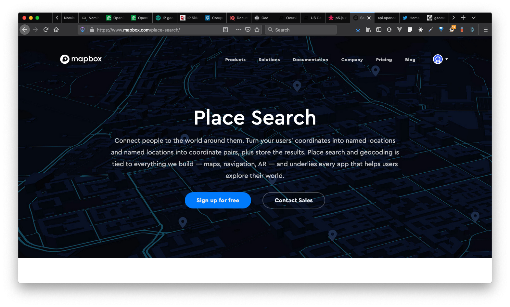
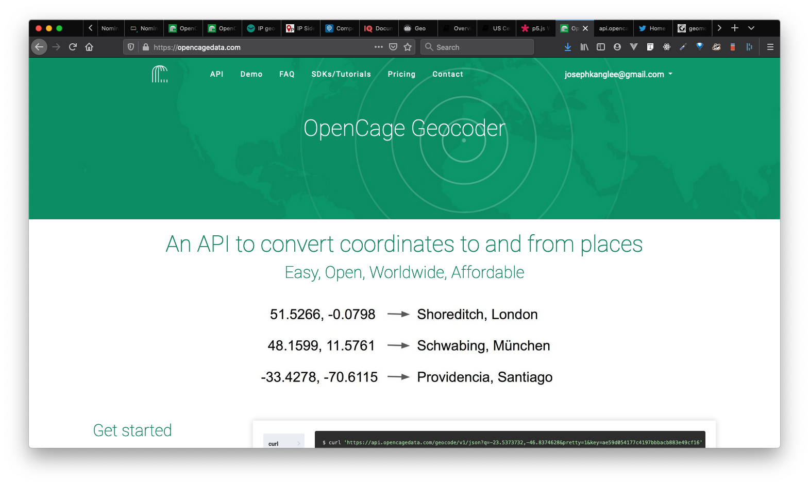

# Geocoding Guide

Sometimes all you have are place names (addresses, zip codes, etc) but no geographic coordinates with which you can place onto a map. In these instances, you have a couple options either you can: 1) perform an [attribute join](https://desktop.arcgis.com/en/arcmap/latest/manage-data/tables/joining-attributes-in-one-table-to-another.htm) -- where, in this case, you take an attribute field from an *aspatial dataset* (e.g. a zip code) and match it to an attribute field within an existing *spatial dataset* (e.g. zip code administrative boundaries w/ a matching zip code field) -- OR you can do what is called 2) **forward geocoding**. 

In this guide, I'll briefly introduce some concepts around geocoding and some tools to help you do so.

- [Geocoding Guide](#geocoding-guide)
  - [How geocoding works](#how-geocoding-works)
  - [Geocoding interfaces](#geocoding-interfaces)
  - [Geocoding APIs](#geocoding-apis)
    - [Mapbox Search (recommended)](#mapbox-search-recommended)
      - [References:](#references)
    - [OpenCage (recommended)](#opencage-recommended)
      - [References:](#references-1)
    - [Nominatim, OSM Geocoder](#nominatim-osm-geocoder)
  - [IP Geocoding](#ip-geocoding)
  - [Build Your Own Geocoding Service](#build-your-own-geocoding-service)
  - [Additional References](#additional-references)

## How geocoding works

There are two types of geocoding: 
* **Forward geocoding**: Forward geocoding allows you to look up a single location by name (address, business name, area code, sometimes even phone numbers!) and returns its geographic coordinates.
* **Reverse geocoding**: Reverse geocoding allows you to take geographic coordinates in the format of latitude and longitude coordinates and get back an address or place name.

The simplest way of understanding how geocoders work is that you can imagine having a gigantic table of values, where you have *aspatial* place names and addresses AND their corresponding geographic coordinates as points (more sophisticated geocoders will have support for understanding other geometry types!):

| place_name | address | coordinates |
| :---------- | ---------- | ---------- |
| ITP | 370 Jay St., Brooklyn, NY | 40.692939, -73.987382 |
| Central Park | Central Park, Manhattan NY | 40.796969, -73.949297 |


When you try to to **forward geocoding** -- search by a place name -- what you would do is pass the address or place name like: `ITP` or `370 Jay St., Brooklyn, NY` and what the geocoder would send back is: `40.692939, -73.987382`.

When you try to to **reverse geocoding** -- search by geographic coordinates -- what you would do is pass the coordinates like: `40.692939, -73.987382` and what the geocoder might send back is: `ITP, 370 Jay St., Brooklyn, NY ` or a list of possibilities. For reverse geocoding, some spatial searching might occur such that the nearest 10 places to that address might be returned in order of proximity. 


## Geocoding interfaces

Geocoding interfaces can be helpful if you just want to quickly look up a location and get back their coordinates. There are many geocoding services. Here's just a few: 

* [Mapbox Search Playground](https://docs.mapbox.com/search-playground/)
* [Geocode.io](https://www.geocod.io/) // USA & Canada
* [Nominatim, OSM Geocoder](https://nominatim.openstreetmap.org/) // Global
* [US Census Geocoder](https://geocoding.geo.census.gov/geocoder/) // USA
  * [Forward Geocoder](https://geocoding.geo.census.gov/geocoder/locations/onelineaddress?form)
  * [Reverse Geocoder](https://geocoding.geo.census.gov/geocoder/geographies/coordinates?form)
* [Google Maps](https://www.google.com/maps) -- use the search bar or try **right click > what's here**

## Geocoding APIs

Most of the time you will likely want to interface with a geocoding service using a programmtic API. This will allow you to do batch geocoding or many addresses or use a geocoding service within your mapping application. 

Below you'll find a few selected geocoding APIs and some examples to get you started.

A few notes about geocoders:
1. Most geocoding APIs run on a freemium model -- you usually get a number of free requests per day, then you have to pay. 
2. Most geocoding APIs will require that you have an API key -- therefore you must sign up with each service to get an API key
3. **advanced**: You *can* set up your own geocoding service in the case that the other APIs do not fulfill your needs, however this process is not trivial!

Some examples highlighted below include:
* Mapbox Search
* OpenCage Search
* Nominatim OSM Search

Others you might check out:
* [LocationIQ Geocoder](https://locationiq.com/docs)
* [GoogleMaps Place Search](https://developers.google.com/places/web-service/search)
* [Geocode.io Search](https://www.geocod.io/features/api/)

### Mapbox Search (recommended)



[Mapbox Search Service API](https://docs.mapbox.com/api/search/) is the geocoding and place search service provided by Mapbox. This comes as my first recommendation because it integrates well with any other mapping applications you might build, Mapbox's usage policies are great IMHO (up to 100,000 requests for free per month!), and they have a lot of really helpful features like batch geocoding and more. 

**🌟First -- make sure to sign up for Mapbox and get an API Key. The API Key provided below is for demo purposes only.**

**Quick start**:
In your terminal try: [based on this example](https://docs.mapbox.com/api/search/#example-request-forward-geocoding)
  ```sh
  curl "https://api.mapbox.com/geocoding/v5/mapbox.places/370%20jay%20st,brooklyn,new%20york.json?access_token=pk.eyJ1Ijoiam9leWtsZWUiLCJhIjoiMlRDV2lCSSJ9.ZmGAJU54Pa-z8KvwoVXVBw"
  ```
  NOTE: The `%20` are URL encodings for spaces such that `370 jay st` becomes `370%20jay%20st`

and this will return:
  ```json
  {
    "type": "FeatureCollection",
    "query": [
        "370",
        "jay",
        "st",
        "brooklyn",
        "new",
        "york"
    ],
    "features": [
        {
            "id": "address.2744775423392320",
            "type": "Feature",
            "place_type": [
                "address"
            ],
            "relevance": 1,
            "properties": {
                "accuracy": "rooftop"
            },
            "text": "Jay Street",
            "place_name": "370 Jay Street, Brooklyn, New York 11201, United States",
            "center": [
                -73.987435,
                40.692744
            ],
            "geometry": {
                "type": "Point",
                "coordinates": [
                    -73.987435,
                    40.692744
                ]
            },
            "address": "370",
            "context": [
                {
                    "id": "neighborhood.297509",
                    "text": "Downtown"
                },
                {
                    "id": "locality.6335122455180360",
                    "wikidata": "Q18419",
                    "text": "Brooklyn"
                },
                {
                    "id": "postcode.15332151625363130",
                    "text": "11201"
                },
                {
                    "id": "place.15278078705964500",
                    "wikidata": "Q60",
                    "text": "New York"
                },
                {
                    "id": "region.10003493535855570",
                    "short_code": "US-NY",
                    "wikidata": "Q1384",
                    "text": "New York"
                },
                {
                    "id": "country.19352517729256050",
                    "short_code": "us",
                    "wikidata": "Q30",
                    "text": "United States"
                }
            ]
        },
        {
            "id": "address.1606938129572216",
            "type": "Feature",
            "place_type": [
                "address"
            ],
            "relevance": 0.671667,
            "properties": {
                "accuracy": "point"
            },
            "text": "Jay Street",
            "place_name": "370 Jay Street, Rochester, New York 14611, United States",
            "center": [
                -77.629972,
                43.159739
            ],
            "geometry": {
                "type": "Point",
                "coordinates": [
                    -77.629972,
                    43.159739
                ]
            },
            "address": "370",
            "context": [
                {
                    "id": "neighborhood.2101698",
                    "text": "Charles House Area Council"
                },
                {
                    "id": "postcode.1606938129572216",
                    "text": "14611"
                },
                {
                    "id": "place.17954033999320780",
                    "wikidata": "Q49218",
                    "text": "Rochester"
                },
                {
                    "id": "region.10003493535855570",
                    "short_code": "US-NY",
                    "wikidata": "Q1384",
                    "text": "New York"
                },
                {
                    "id": "country.19352517729256050",
                    "short_code": "us",
                    "wikidata": "Q30",
                    "text": "United States"
                }
            ]
        },
        {
            "id": "address.8396812616214106",
            "type": "Feature",
            "place_type": [
                "address"
            ],
            "relevance": 0.671667,
            "properties": {
                "accuracy": "interpolated"
            },
            "text": "Jay Street",
            "place_name": "370 Jay Street, Geneva, New York 14456, United States",
            "center": [
                -76.996361,
                42.850868
            ],
            "geometry": {
                "type": "Point",
                "coordinates": [
                    -76.996361,
                    42.850868
                ],
                "interpolated": true
            },
            "address": "370",
            "context": [
                {
                    "id": "postcode.6161218161392640",
                    "text": "14456"
                },
                {
                    "id": "place.6743870303408720",
                    "wikidata": "Q1378284",
                    "text": "Geneva"
                },
                {
                    "id": "region.10003493535855570",
                    "short_code": "US-NY",
                    "wikidata": "Q1384",
                    "text": "New York"
                },
                {
                    "id": "country.19352517729256050",
                    "short_code": "us",
                    "wikidata": "Q30",
                    "text": "United States"
                }
            ]
        },
        {
            "id": "address.2212559001284282",
            "type": "Feature",
            "place_type": [
                "address"
            ],
            "relevance": 0.671667,
            "properties": {
                "accuracy": "interpolated"
            },
            "text": "Jay Street",
            "place_name": "370 Jay Street, Katonah, New York 10536, United States",
            "center": [
                -73.66226,
                41.248698
            ],
            "geometry": {
                "type": "Point",
                "coordinates": [
                    -73.66226,
                    41.248698
                ],
                "interpolated": true
            },
            "address": "370",
            "context": [
                {
                    "id": "neighborhood.2102774",
                    "text": "Katonah"
                },
                {
                    "id": "postcode.12846207349124210",
                    "text": "10536"
                },
                {
                    "id": "place.12830682659459960",
                    "wikidata": "Q2888777",
                    "text": "Katonah"
                },
                {
                    "id": "region.10003493535855570",
                    "short_code": "US-NY",
                    "wikidata": "Q1384",
                    "text": "New York"
                },
                {
                    "id": "country.19352517729256050",
                    "short_code": "us",
                    "wikidata": "Q30",
                    "text": "United States"
                }
            ]
        },
        {
            "id": "address.2424062565337350",
            "type": "Feature",
            "place_type": [
                "address"
            ],
            "relevance": 0.671667,
            "properties": {
                "accuracy": "interpolated"
            },
            "text": "Jay Street",
            "place_name": "370 Jay Street, Freeport, New York 11520, United States",
            "center": [
                -73.584904,
                40.665888
            ],
            "geometry": {
                "type": "Point",
                "coordinates": [
                    -73.584904,
                    40.665888
                ],
                "interpolated": true,
                "omitted": true
            },
            "address": "370",
            "context": [
                {
                    "id": "neighborhood.287879",
                    "text": "Downtown"
                },
                {
                    "id": "postcode.2695303055935540",
                    "text": "11520"
                },
                {
                    "id": "place.6296583043304260",
                    "wikidata": "Q1323073",
                    "text": "Freeport"
                },
                {
                    "id": "region.10003493535855570",
                    "short_code": "US-NY",
                    "wikidata": "Q1384",
                    "text": "New York"
                },
                {
                    "id": "country.19352517729256050",
                    "short_code": "us",
                    "wikidata": "Q30",
                    "text": "United States"
                }
            ]
        }
    ],
    "attribution": "NOTICE: © 2020 Mapbox and its suppliers. All rights reserved. Use of this data is subject to the Mapbox Terms of Service (https://www.mapbox.com/about/maps/). This response and the information it contains may not be retained. POI(s) provided by Foursquare."
}
  ```

→ You can also try running this in the p5 web editor: [Mapbox Geocoder example using p5](https://editor.p5js.org/joeyklee/sketches/l7HZ9Y7mA)


#### References:
* [Usage Policy and pricing](https://www.mapbox.com/pricing/#search)
* [Documentation](https://docs.mapbox.com/api/search/)
* [Geocoding playground](https://docs.mapbox.com/search-playground/)


### OpenCage (recommended)



OpenCage is a geocoding service based in Germany. They seem like nice people and in support of open source geo and strong data protections. Their API is well documented with lots of tutorials and examples. What is interesting about OpenCage is that they also include additional locational information like the [What3Words](https://what3words.com/) location, currency info, calling codes and more -- really handy info for many reasons when building web services and more.

**🌟First -- make sure to sign up for OpenCage and get an API Key.**

**Quick start**:
In your terminal try:
  ```sh
  curl "https://api.opencagedata.com/geocode/v1/json?q=370%20jay%20st,brooklyn,new%20york&key=YOURKEYGOESHERE&pretty=1"
  ```
  NOTE: The `%20` are URL encodings for spaces such that `370 jay st` becomes `370%20jay%20st` and the `YOURKEYGOESHERE` should be replaced with your API key.

and this will return:

  ```json
  {
     "documentation" : "https://opencagedata.com/api",
     "licenses" : [
        {
           "name" : "see attribution guide",
           "url" : "https://opencagedata.com/credits"
        }
     ],
     "rate" : {
        "limit" : 2500,
        "remaining" : 2498,
        "reset" : 1586649600
     },
     "results" : [
        {
           "annotations" : {
              "DMS" : {
                 "lat" : "40\u00b0 41' 34.02492'' N",
                 "lng" : "73\u00b0 59' 15.23616'' W"
              },
              "FIPS" : {
                 "county" : "36047",
                 "state" : "36"
              },
              "MGRS" : "18TWL8554205146",
              "Maidenhead" : "FN30aq16lg",
              "Mercator" : {
                 "x" : -8236258.128,
                 "y" : 4939267.072
              },
              "OSM" : {
                 "edit_url" : "https://www.openstreetmap.org/edit?way=241846072#map=17/40.69278/-73.98757",
                 "note_url" : "https://www.openstreetmap.org/note/new#map=17/40.69278/-73.98757&layers=N",
                 "url" : "https://www.openstreetmap.org/?mlat=40.69278&mlon=-73.98757#map=17/40.69278/-73.98757"
              },
              "UN_M49" : {
                 "regions" : {
                    "AMERICAS" : "019",
                    "NORTHERN_AMERICA" : "021",
                    "US" : "840",
                    "WORLD" : "001"
                 },
                 "statistical_groupings" : [
                    "MEDC"
                 ]
              },
              "callingcode" : 1,
              "currency" : {
                 "alternate_symbols" : [
                    "US$"
                 ],
                 "decimal_mark" : ".",
                 "disambiguate_symbol" : "US$",
                 "html_entity" : "$",
                 "iso_code" : "USD",
                 "iso_numeric" : "840",
                 "name" : "United States Dollar",
                 "smallest_denomination" : 1,
                 "subunit" : "Cent",
                 "subunit_to_unit" : 100,
                 "symbol" : "$",
                 "symbol_first" : 1,
                 "thousands_separator" : ","
              },
              "flag" : "\ud83c\uddfa\ud83c\uddf8",
              "geohash" : "dr5rkrgusub7xh5yypyy",
              "qibla" : 58.49,
              "roadinfo" : {
                 "drive_on" : "right",
                 "road" : "Jay Street",
                 "speed_in" : "mph"
              },
              "sun" : {
                 "rise" : {
                    "apparent" : 1586600580,
                    "astronomical" : 1586594820,
                    "civil" : 1586598900,
                    "nautical" : 1586596920
                 },
                 "set" : {
                    "apparent" : 1586647860,
                    "astronomical" : 1586567280,
                    "civil" : 1586649540,
                    "nautical" : 1586565180
                 }
              },
              "timezone" : {
                 "name" : "America/New_York",
                 "now_in_dst" : 1,
                 "offset_sec" : -14400,
                 "offset_string" : "-0400",
                 "short_name" : "EDT"
              },
              "what3words" : {
                 "words" : "hooked.sheep.image"
              },
              "wikidata" : "Q27988196"
           },
           "bounds" : {
              "northeast" : {
                 "lat" : 40.6933149,
                 "lng" : -73.9873898
              },
              "southwest" : {
                 "lat" : 40.6923217,
                 "lng" : -73.9880684
              }
           },
           "components" : {
              "ISO_3166-1_alpha-2" : "US",
              "ISO_3166-1_alpha-3" : "USA",
              "_category" : "building",
              "_type" : "building",
              "building" : "NYU CUSP",
              "city" : "New York",
              "continent" : "North America",
              "country" : "United States of America",
              "country_code" : "us",
              "county" : "Kings County",
              "house_number" : "370",
              "neighbourhood" : "Downtown Brooklyn",
              "postcode" : "11201",
              "road" : "Jay Street",
              "state" : "New York",
              "state_code" : "NY",
              "suburb" : "Brooklyn"
           },
           "confidence" : 10,
           "formatted" : "NYU CUSP, 370 Jay Street, New York, NY 11201, United States of America",
           "geometry" : {
              "lat" : 40.6927847,
              "lng" : -73.9875656
           }
        },
        {
           "annotations" : {
              "DMS" : {
                 "lat" : "40\u00b0 41' 33.63360'' N",
                 "lng" : "73\u00b0 59' 13.90560'' W"
              },
              "FIPS" : {
                 "state" : "36"
              },
              "MGRS" : "18TWL8557305135",
              "Maidenhead" : "FN30aq16mf",
              "Mercator" : {
                 "x" : -8236216.984,
                 "y" : 4939251.181
              },
              "OSM" : {
                 "note_url" : "https://www.openstreetmap.org/note/new#map=17/40.69268/-73.98720&layers=N",
                 "url" : "https://www.openstreetmap.org/?mlat=40.69268&mlon=-73.98720#map=17/40.69268/-73.98720"
              },
              "UN_M49" : {
                 "regions" : {
                    "AMERICAS" : "019",
                    "NORTHERN_AMERICA" : "021",
                    "US" : "840",
                    "WORLD" : "001"
                 },
                 "statistical_groupings" : [
                    "MEDC"
                 ]
              },
              "callingcode" : 1,
              "currency" : {
                 "alternate_symbols" : [
                    "US$"
                 ],
                 "decimal_mark" : ".",
                 "disambiguate_symbol" : "US$",
                 "html_entity" : "$",
                 "iso_code" : "USD",
                 "iso_numeric" : "840",
                 "name" : "United States Dollar",
                 "smallest_denomination" : 1,
                 "subunit" : "Cent",
                 "subunit_to_unit" : 100,
                 "symbol" : "$",
                 "symbol_first" : 1,
                 "thousands_separator" : ","
              },
              "flag" : "\ud83c\uddfa\ud83c\uddf8",
              "geohash" : "dr5rkruhj2s5d071d4j8",
              "qibla" : 58.5,
              "roadinfo" : {
                 "drive_on" : "right",
                 "road" : "Jay St",
                 "speed_in" : "mph"
              },
              "sun" : {
                 "rise" : {
                    "apparent" : 1586600580,
                    "astronomical" : 1586594820,
                    "civil" : 1586598900,
                    "nautical" : 1586596920
                 },
                 "set" : {
                    "apparent" : 1586647860,
                    "astronomical" : 1586567280,
                    "civil" : 1586649540,
                    "nautical" : 1586565180
                 }
              },
              "timezone" : {
                 "name" : "America/New_York",
                 "now_in_dst" : 1,
                 "offset_sec" : -14400,
                 "offset_string" : "-0400",
                 "short_name" : "EDT"
              },
              "what3words" : {
                 "words" : "actors.drift.blows"
              }
           },
           "components" : {
              "ISO_3166-1_alpha-2" : "US",
              "ISO_3166-1_alpha-3" : "USA",
              "_category" : "road",
              "_type" : "road",
              "continent" : "North America",
              "country" : "United States of America",
              "country_code" : "us",
              "road" : "Jay St",
              "state" : "New York",
              "state_code" : "NY",
              "town" : "Brooklyn"
           },
           "confidence" : 7,
           "formatted" : "Jay St, Brooklyn, NY, United States of America",
           "geometry" : {
              "lat" : 40.692676,
              "lng" : -73.987196
           }
        },
        {
           "annotations" : {
              "DMS" : {
                 "lat" : "40\u00b0 38' 3.80400'' N",
                 "lng" : "73\u00b0 57' 0.97200'' W"
              },
              "FIPS" : {
                 "state" : "36"
              },
              "MGRS" : "18TWK8877098701",
              "Maidenhead" : "FN30ap52xg",
              "Mercator" : {
                 "x" : -8232106.4,
                 "y" : 4930730.568
              },
              "OSM" : {
                 "note_url" : "https://www.openstreetmap.org/note/new#map=17/40.63439/-73.95027&layers=N",
                 "url" : "https://www.openstreetmap.org/?mlat=40.63439&mlon=-73.95027#map=17/40.63439/-73.95027"
              },
              "UN_M49" : {
                 "regions" : {
                    "AMERICAS" : "019",
                    "NORTHERN_AMERICA" : "021",
                    "US" : "840",
                    "WORLD" : "001"
                 },
                 "statistical_groupings" : [
                    "MEDC"
                 ]
              },
              "callingcode" : 1,
              "currency" : {
                 "alternate_symbols" : [
                    "US$"
                 ],
                 "decimal_mark" : ".",
                 "disambiguate_symbol" : "US$",
                 "html_entity" : "$",
                 "iso_code" : "USD",
                 "iso_numeric" : "840",
                 "name" : "United States Dollar",
                 "smallest_denomination" : 1,
                 "subunit" : "Cent",
                 "subunit_to_unit" : 100,
                 "symbol" : "$",
                 "symbol_first" : 1,
                 "thousands_separator" : ","
              },
              "flag" : "\ud83c\uddfa\ud83c\uddf8",
              "geohash" : "dr5rjjr03z61fz0zdq4y",
              "qibla" : 58.52,
              "roadinfo" : {
                 "drive_on" : "right",
                 "speed_in" : "mph"
              },
              "sun" : {
                 "rise" : {
                    "apparent" : 1586600580,
                    "astronomical" : 1586594820,
                    "civil" : 1586598900,
                    "nautical" : 1586596920
                 },
                 "set" : {
                    "apparent" : 1586647860,
                    "astronomical" : 1586567280,
                    "civil" : 1586649540,
                    "nautical" : 1586565120
                 }
              },
              "timezone" : {
                 "name" : "America/New_York",
                 "now_in_dst" : 1,
                 "offset_sec" : -14400,
                 "offset_string" : "-0400",
                 "short_name" : "EDT"
              },
              "what3words" : {
                 "words" : "herbs.scan.blunt"
              }
           },
           "bounds" : {
              "northeast" : {
                 "lat" : 40.739446,
                 "lng" : -73.833365
              },
              "southwest" : {
                 "lat" : 40.551042,
                 "lng" : -74.05663
              }
           },
           "components" : {
              "ISO_3166-1_alpha-2" : "US",
              "ISO_3166-1_alpha-3" : "USA",
              "_category" : "place",
              "_type" : "county",
              "continent" : "North America",
              "country" : "United States of America",
              "country_code" : "us",
              "county" : "Brooklyn",
              "state" : "New York",
              "state_code" : "NY"
           },
           "confidence" : 5,
           "formatted" : "Brooklyn, NY, United States of America",
           "geometry" : {
              "lat" : 40.63439,
              "lng" : -73.95027
           }
        }
     ],
     "status" : {
        "code" : 200,
        "message" : "OK"
     },
     "stay_informed" : {
        "blog" : "https://blog.opencagedata.com",
        "twitter" : "https://twitter.com/opencagedata"
     },
     "thanks" : "For using an OpenCage API",
     "timestamp" : {
        "created_http" : "Sat, 11 Apr 2020 17:14:59 GMT",
        "created_unix" : 1586625299
     },
     "total_results" : 3
  }
  ```

→ You can also try running this in the p5 web editor: [OpenCage Geocoder example using p5](https://editor.p5js.org/joeyklee/sketches/cO6CRYjUV)

#### References:
* [Usage Policy and pricing](https://opencagedata.com/pricing)
* [Documentation](https://opencagedata.com/api) - see their [best practices](https://opencagedata.com/api#forward-resp)
* [Geocoding playground](https://opencagedata.com/demo)
* [Tutorials](https://opencagedata.com/code#tutorials)

  
<!-- 
### LocationIQ
#### References:
* [Usage Policy and pricing](https://locationiq.com/pricing)
* [Documentation](https://locationiq.com/docs) -->


### Nominatim, OSM Geocoder

[Nominatim, OSM Geocoder](https://nominatim.openstreetmap.org/) is OpenStreetMap's Open Geocoder service. 

Please read their [usage policies](https://operations.osmfoundation.org/policies/nominatim/) -- basically you can make ~1 request per second, so batch requests are out! In any case, it is still a handy API. 

**Quick start**:
In your terminal try:
  ```sh
  curl https://nominatim.openstreetmap.org/search?street=370%20jay%20st&city=brooklyn&state=new%20york&format=json
  ```
  NOTE: The `%20` are URL encodings for spaces such that `370 jay st` becomes `370%20jay%20st`

and this will return:
  ```json
  [
    {
        "place_id": 146068629,
        "licence": "Data © OpenStreetMap contributors, ODbL 1.0. https://osm.org/copyright",
        "osm_type": "way",
        "osm_id": 241846072,
        "boundingbox": [
            "40.6923217",
            "40.6933149",
            "-73.9880684",
            "-73.9873898"
        ],
        "lat": "40.69278465",
        "lon": "-73.98756559887298",
        "display_name": "NYU CUSP, 370, Jay Street, Downtown Brooklyn, Brooklyn, Kings County, New York, 11201, United States of America",
        "class": "building",
        "type": "school",
        "importance": 0.9145652793462674
    }
]
  ```

→ You can also try running this in the p5 web editor: [Nominatim Geocoder example using p5](https://editor.p5js.org/joeyklee/sketches/23934mLwY)


## IP Geocoding

We're not going to talk so much about IP Address geocoding since in principal it works the same way as the above. [OpenCage writes about IP Address geocoding](https://opencagedata.com/faq) in their FAQ and their [blog post on using IP info](https://blog.opencagedata.com/post/tools-we-use-ipinfo). They recommend a few services for IP Address geocoding: 
  * [IPInfo](https://ipinfo.io/)
  * [IP Sidekick](https://ipsidekick.com/)
  * [IP Vigilante](https://www.ipvigilante.com/)

[James Bridle Citizen Ex](https://jamesbridle.com/works/citizen-ex) project uses OP addresses as away to rethink ideas around citizenship.

## Build Your Own Geocoding Service

Most of the open-source geocoding platforms are designed for you to host your own geocoding server. Here's a few in case you're keen to try doing this:

* [Pelias Geocoder](https://pelias.io/)
  * [Pelias Documentation](https://github.com/pelias/documentation)
  * [Installation w/ Docker](https://github.com/pelias/pelias/#how-can-i-install-my-own-instance-of-pelias) // NOTE: Installation is not trivial!
* [OpenAddresses.io](https://openaddresses.io/)


## Additional References

* On Pelias:
  * [Julian Simioni, Why Geocoding is Hard and How You and OSM Can Help, 2018](https://www.youtube.com/watch?v=qKvO5yeXsFE)
  * [Pelias - A new OSM Geocoder w/ Elastic Search - Randy Meech](https://www.youtube.com/watch?v=rgostpWq0C4)
* [Geocoding and reverse geocoding - Geocasts](https://www.youtube.com/watch?v=2IIhGA1cfmc)
* [James Bridle Citizen Ex](https://jamesbridle.com/works/citizen-ex)
