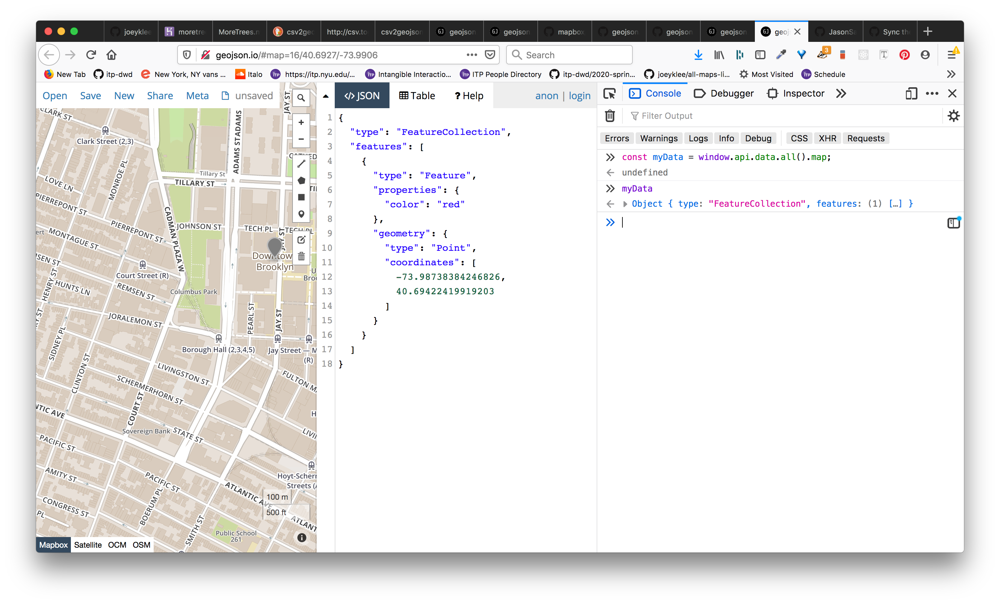

# Geojson.io Guide

Guide to using [Geojson.io](http://geojson.io) - a super handy tool for inspecting and creating geojson (and other spatial formats) in the browser.

## Some notes on GeoJSON data

If you're interested to learn more about the geoJSON data format, Tom MacWright has written some nice blog posts about this:

* [Everything you need to know now about RFC 7946 GeoJSON, Tom MacWright](https://macwright.org/2016/11/07/the-geojson-ietf-standard.html)
* [More than you'd ever want to know about GeoJSON, Tom MacWright](https://macwright.org/2015/03/23/geojson-second-bite.html)

# Methods

## Importing data

### Loading geojson & csv

Quite likely along your geo-journey, you will be creating and saving data in varying formats. Quite likely these will be **geojson** and **csv** data. You can load these files right up by doing: 
`Open > File > select: yourdata.geojson`

Your data then will display right on the map if it is formatted properly! If your data isn't loaded, you may try to run it through a linter which will check if your file is formatted properly:
* [GeoJSON Lint](http://www.geojsonlint.com/)
* [CSV Lint](https://csvlint.io/)


### Reading data from Github & Github Gists

Geojson.io will allow you to read in data stored in Github if you allow the application to do so. If you go to `login` it will use Github's OAuth to authenticate you. This will allow you to save your geojson data to Github and as github Gists. Super handy!


***
***
***

## Making Data

### Making Data Best Practices

Geojson.io makes it really easy to make and display data. However, just because you can willy-nilly make data doesn't mean you should. Some good data practices are listed below:

1. Keep your data organized **based on their geometries** - don't mix and match. Keep your point data with your points and your lines with your lines. 
2. Keep your data **organized conceptually or thematically** - e.g. squirrel sightings or [rat sightings](http://maptimeboston.github.io/leaflet-intro/) are point data about topic or theme X, Y or Z in one file or GPS trails of all your data walks would be polyline data in another file.

Below are the data types you can make interactively with geojson.io:

### Markers


### Rectangles


### Polylines


### Polygons


***
***
***

## Sharing/Exporting/Saving Data

Let's say you have a geojson that looks like this...

```json
{
  "type": "FeatureCollection",
  "features": [
    {
      "type": "Feature",
      "properties": {
        "color": "red"
      },
      "geometry": {
        "type": "Point",
        "coordinates": [
          -73.98738384246826,
          40.69422419919203
        ]
      }
    }
  ]
}
```

...and you want to share that data rendered on a map in geojson.io, you can do so by sharing the data in a number of ways. 

### Sharing as a URL

Part of the Geojson.io API allows us to create data and share it in a nice way. Let's say we have some data we created in geojson.io, e.g. like the point data we created above, what we can do if we want to share this data is:

* Step 1: encode that geojson into a URI encoded string (basically a long string that can be parsed by your browser's nav bar) → 

   | before    | → | after |
   |:----    | ---| ----- |
   |   `{"type":"FeatureCollection","features":{"type":"Feature","properties":{"color":"red"},"geometry":{"type":"Point","coordinates":[-73.98738384246826,40.69422419919203]}}]}`       |  `encodeURIComponent(JSON.stringify(myData))`  |  http://geojson.io/#data=data:application/json,%7B%22type%22%3A%22FeatureCollection%22%2C%22features%22%3A%5B%7B%22type%22%3A%22Feature%22%2C%22properties%22%3A%7B%22color%22%3A%22red%22%7D%2C%22geometry%22%3A%7B%22type%22%3A%22Point%22%2C%22coordinates%22%3A%5B-73.98738384246826%2C40.69422419919203%5D%7D%7D%5D%7D |

* Step 2: then append that long string at the end of the this `http://geojson.io/#data=data:application/json,` url so we can get a URL of our map and data we can share:
     ```txt
     http://geojson.io/#data=data:application/json,%7B%22type%22%3A%22FeatureCollection%22%2C%22features%22%3A%5B%7B%22type%22%3A%22Feature%22%2C%22properties%22%3A%7B%22color%22%3A%22red%22%7D%2C%22geometry%22%3A%7B%22type%22%3A%22Point%22%2C%22coordinates%22%3A%5B-73.98738384246826%2C40.69422419919203%5D%7D%7D%5D%7D
     ```

To acheive this, follow the steps below:

1. Step 1: open your browser's **dev tools**:
2. Step 2: store your current map data into a variable. Let's just call this `myData`. To do this, type into your **dev tool console**:
   ```js
   const myData = window.api.data.all().map;
   ```
   
   
3. Step 3: Turn your geojson data into a encoded URI string and append it to the end of the geojson.io url. To do this, type into your **dev tools console**:  
   ```js
   const mapUrl = `http://geojson.io/#data=data:application/json,${encodeURIComponent(JSON.stringify(myData))}`
   ```
   
4. Step 4: type `mapUrl` in the **dev tools console** to get back your data encoded in a nice way for geojson.io to render your data when navigating to that url:
     ```js
     "http://geojson.io/#data=data:application/json,%7B%22type%22%3A%22FeatureCollection%22%2C%22features%22%3A%5B%7B%22type%22%3A%22Feature%22%2C%22properties%22%3A%7B%22color%22%3A%22red%22%7D%2C%22geometry%22%3A%7B%22type%22%3A%22Point%22%2C%22coordinates%22%3A%5B-73.98738384246826%2C40.69422419919203%5D%7D%7D%5D%7D"
     ```
5. Step 5: Take everything between the quotations `" ... "` and paste that into another browser window navigation bar to see the super cool map!
  

### Exporting formats


## References

* [Geojson.io URL API](https://github.com/mapbox/geojson.io/blob/gh-pages/API.md#url-api)
* [Geojson.io Console API](https://github.com/mapbox/geojson.io/blob/gh-pages/API.md#console-api)
* [Everything you need to know now about RFC 7946 GeoJSON, Tom MacWright](https://macwright.org/2016/11/07/the-geojson-ietf-standard.html)
* [More than you'd ever want to know about GeoJSON, Tom MacWright](https://macwright.org/2015/03/23/geojson-second-bite.html)
