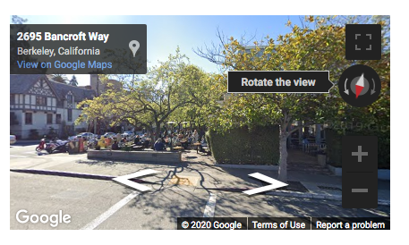
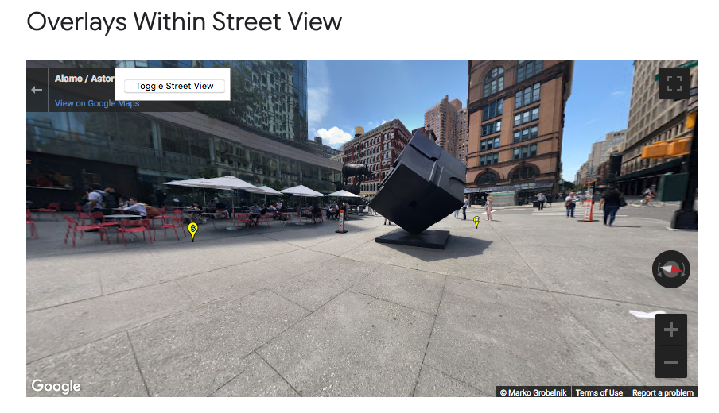
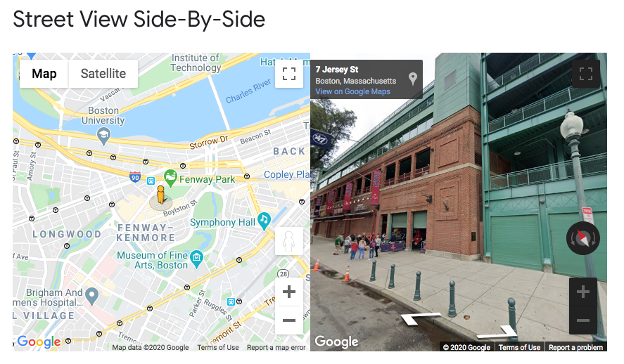
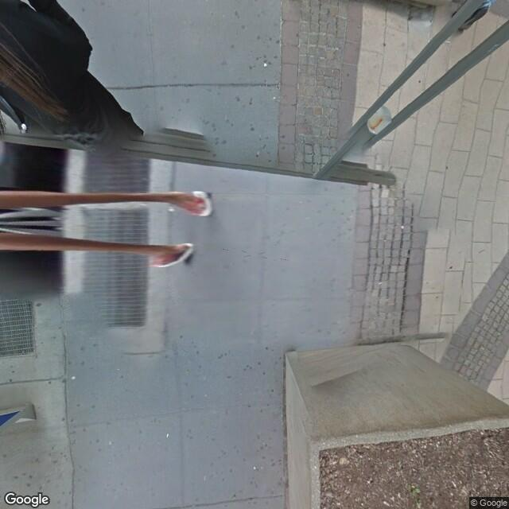
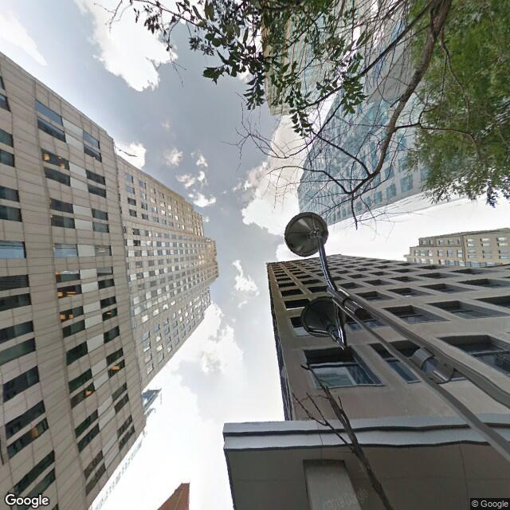

# Google Streetview API Guide

This is a guide on how to use the google street view API. 

- [Google Streetview API Guide](#google-streetview-api-guide)
- [Setup](#setup)
- [Street View - JavaScript API](#street-view---javascript-api)
  - [Introduction](#introduction)
  - [Examples](#examples)
- [Street View - Static Image API](#street-view---static-image-api)
  - [Introduction](#introduction-1)
  - [Examples](#examples-1)
    - [Looking at the Ground: `pitch=-90`](#looking-at-the-ground-pitch-90)
    - [Looking at the Sky: `pitch=90`](#looking-at-the-sky-pitch90)
  - [References](#references)


# Setup

1. Sign up with Google - TBD
2. Create an API key - TBD


# Street View - JavaScript API
You can create interactive street view instances on a webpage, using the Google Street View API. This section introduces how the API is structured and showcases some examples.

## Introduction

Accessing google streetview in JavaScript is about using the `google.maps.StreetViewPanorama` class. Let's take a look at what this entails.

Note: this example is a slightly re-written version of this [Basic Example](https://developers.google.com/maps/documentation/javascript/streetview).



**Project structure:**
```
my-streetview-project/
 index.html
 main.js
 main.css
```

In **index.html**: 
* Your classic HTML boilerplate code with the addition of a `<div id="street-view"></div>` and our Google maps javascript library.
* 👉 **Make sure to add `YOUR_API_KEY` when referencing the library.**
  ```html
  <!DOCTYPE html>
  <html lang="en">
    <head>
      <meta charset="utf-8" />
      <meta http-equiv="x-ua-compatible" content="ie=edge" />
      <meta name="viewport" content="width=device-width, initial-scale=1" />
      <title>StreetView</title>
      <link rel="stylesheet" href="main.css" />
      <link rel="icon" href="images/favicon.png" />
    </head>

    <body>
      <div id="street-view"></div>
      <script src="https://maps.googleapis.com/maps/api/js?key=YOUR_API_KEY"></script>
      <script src="main.js"></script>
    </body>
  </html>
  ```

In **main.css**: 
* Some standard CSS

  ```css
  html, body {
    height: 100%;
    margin: 0;
    padding: 0;
    box-sizing:border-box;
  }
  #street-view {
    height: 100%;
  }
  ```

In **main.js**: 
* Oooh this is where things get interesting.
  
  ```js
  window.addEventListener('DOMContentLoaded', async () => {
    // Step 1: Use your JS selector to select that element in your HTML
    const myStreetViewElement = document.querySelector('#street-view');

    //  Step 2: Set the options for the street view panorama
    const options = {
       position: {
         lat: 37.869260, 
         lng: -122.254811
       },
       pov: {
         heading: 165, 
         pitch: 0
      },
       zoom: 1
     }
    
    //  Step 3: create a new google street view panorama by passing in the DOM element 
    // where it will be rendered and the options above
    const panorama = new google.maps.StreetViewPanorama( myStreetViewElement, options);
  });

  ```
1. Step 1: Use your JS selector to select that element in your HTML
2. Step 2: Set the options for the street view panorama, this includes the `position`, `point of view`, and `zoom`.
3. Step 3: create a new google street view panorama by passing in the DOM element where it will be rendered (i.e. the `<div id="street-view"></div>`) and the options defined above.

And voila! Pretty much that's all there is to it. The examples in the next section will showcase how you can do some cool things like put a map side-by-side with the street view panorama, create spatial overlays, and more. 

## Examples

* [Basic Example](https://developers.google.com/maps/documentation/javascript/streetview)
  * 
* [Street view Overlays: location pins shown on street view](https://developers.google.com/maps/documentation/javascript/examples/streetview-overlays)
  * 
* [Street view side-by-side with a map](https://developers.google.com/maps/documentation/javascript/examples/streetview-simple)
  * 


# Street View - Static Image API

Aside from creating interactive streetview instances on a webpage, you can also get the static images from the Google Street View API via their REST API. This section introduces how the API is structured and showcases some examples.

## Introduction

```md
https://maps.googleapis.com/maps/api/streetview?size={IMAGE_WIDTH}x{IMAGE_HEIGHT}&location={LATITUDE},{LONGITUDE}
&fov={FOV}&heading={HEADING}&pitch={PITCH}
&key={YOUR_API_KEY_HERE}
```
Parameters Explained:
* **IMAGE_WIDTH**:
  * Image width output in pixels: (0 - 640)px
* **IMAGE_HEIGHT**:
  * Image height output in pixels: (0 - 640)px
* **LATITUDE**:
  * Latitude in decimal degrees: (-90 to 90), depends on coverage
* **LONGITUDE**:
  * Latitude in decimal degrees: (-180 to 180), depends on coverage
* **FOV**:
  * Field of View: (0 to 180)
* **HEADING**:
  * Heading - compass direction: (0 to look north, 90 to look east,  180 to look south, 270, to look west)
* **PITCH**:
  * Pitch - looking up or down: (-90 to look all the way down, 0 to look straight, 90 to look all the way up)
* **YOUR_API_KEY_HERE**:
  * Your API key created through the google cloud console.
  

## Examples

### Looking at the Ground: `pitch=-90`


```
https://maps.googleapis.com/maps/api/streetview?size=640x640&location=40.693351,-73.987258
&fov=360&heading=180&pitch=-90
&key=YOUR_API_KEY_HERE
```

### Looking at the Sky: `pitch=90`



```
https://maps.googleapis.com/maps/api/streetview?size=640x640&location=40.693351,-73.987258
&fov=360&heading=180&pitch=90
&key=YOUR_API_KEY_HERE
```

## References 
* [Sorting Google Maps](https://medium.com/data-mining-the-city/sorting-google-street-view-68665f8fa8e8)