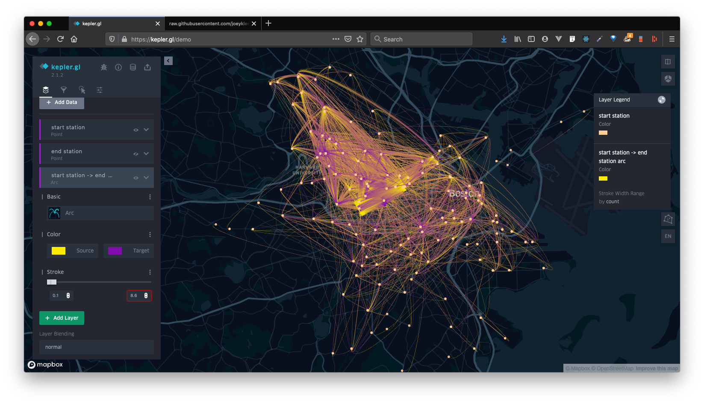
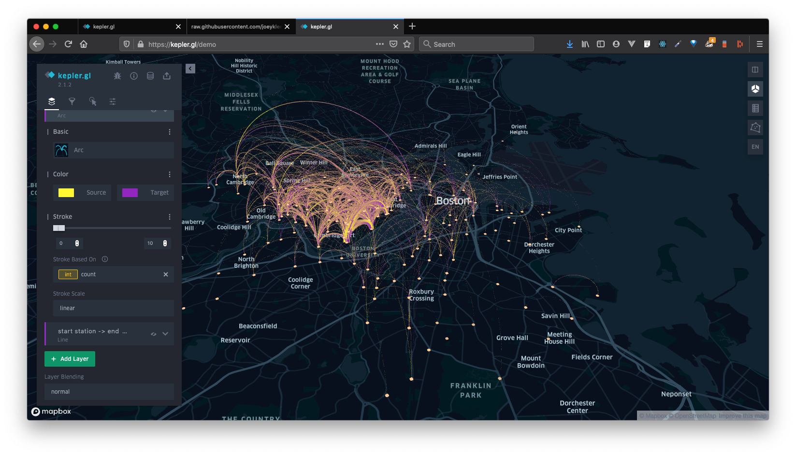
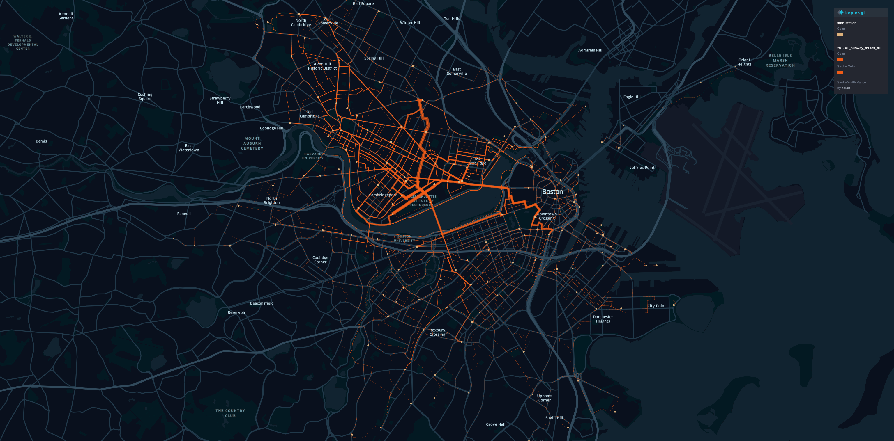
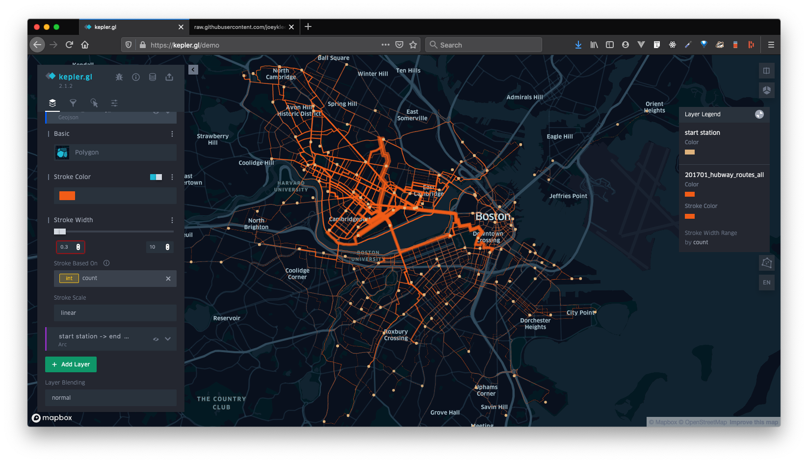

# Kepler.gl Guide

> Kepler.gl is a powerful open source geospatial analysis tool for large-scale data sets.

## About

**Kepler.gl** is an open source project by Uber that wraps their powerful [Deck.gl](https://deck.gl) mapping framework into a really slick, full-featured web interface. Your data stays right in your browser, you can add interactivity to your data, and you can export your visualizations as images and as an HTML file you can host on your platform of choice. No installation needed. 

This guide is a gentle introduction to kepler.gl.

## Before you start

In order to export maps, you'll need your own Mapbox API key. To get a Mapbox API key you can [Sign up with Mapbox](https://www.mapbox.com/). You can learn more about how [Mapbox API keys work here](https://docs.mapbox.com/help/how-mapbox-works/access-tokens/).

You might also take a look at:
* [Geojson.io Guide](./geojson-io.md) in case you want to make your own geojson data to use in Kepler.gl or the [csv to geojson guide]() in case you have CSV data you want to turn into GeoJSON (though Kepler will already be able to parse this for you).
* [The Geospatial data guide]() // it is still a work in progress, but there might be some helpful tips.
* [Anatomy of a web map](http://maptime.io/anatomy-of-a-web-map/#0) to learn more about web maps

## Data you can use

When exploring a new tool, I find it helpful to try and recreate a visualization or analysis done by other reputable mappers. I've selected some data sets and their accompanying reporting in case you're looking for some inspiration.

* Jeremy Singer Vine, "These Maps Show a Massive Gender Gap in Bicycle-Riding". 
  * [Article](https://www.buzzfeed.com/jsvine/these-maps-show-a-massive-gender-gap-in-bicycle-riding), 
  * [NYC Data](https://raw.githubusercontent.com/BuzzFeedNews/2014-06-bikeshare-gender-maps/master/html/data/nyc.geojson), 
  * [Github Repo](https://github.com/BuzzFeedNews/2014-06-bikeshare-gender-maps), 
  * [Other City Data](https://github.com/BuzzFeedNews/2014-06-bikeshare-gender-maps/tree/master/html/data)
* Lam Thuy Vo, "They Played Dominoes Outside Their Apartment For Decades. Then The White People Moved In And Police Started Showing Up.".
  * [Article](https://www.buzzfeednews.com/article/lamvo/gentrification-complaints-311-new-york)
  * [Data - complaint counts merged with census tract](https://raw.githubusercontent.com/BuzzFeedNews/2018-06-nyc-311-complaints-and-gentrification/master/output/merged_complaints_final.json)
  * [Github Repo](https://github.com/BuzzFeedNews/2018-06-nyc-311-complaints-and-gentrification)
  * [All Data outputs](https://github.com/BuzzFeedNews/2018-06-nyc-311-complaints-and-gentrification/tree/master/output)
* Hubway Bike Share Data January 2017:
  * Hubway Count data [Hello Vector Tiles Workshop](https://github.com/joeyklee/hello-vector-tiles):
    * [Hubway Station Data](https://raw.githubusercontent.com/joeyklee/hello-vector-tiles/master/data/201701-hubway-tripdata-counts.csv)
    * [Routed Data](https://github.com/joeyklee/hello-vector-tiles/blob/master/data/201701_hubway_routes_all.geojson)
    * [Hubway Stations](https://github.com/joeyklee/hello-vector-tiles/blob/master/data/hubway_Stations_201606.geojson)

## Kepler.gl User Guide

The Kepler.gl [User Guide](https://github.com/keplergl/kepler.gl/blob/master/docs/user-guides/a-introduction.md) is super well documented. You should start by going through these documents to get a feeling of what kepler.gl has to offer.

My recommendation would be:
1. **Start by getting a feel for the data driven Workflow**. The [Getting started](https://github.com/keplergl/kepler.gl/blob/master/docs/user-guides/j-get-started.md) guide will walk you through how to:
   1. [Add Data](https://github.com/keplergl/kepler.gl/blob/master/docs/user-guides/b-kepler-gl-workflow/a-add-data-to-the-map.md) to your map
   2. [Add Data Layers](https://github.com/keplergl/kepler.gl/blob/master/docs/user-guides/b-kepler-gl-workflow/b-add-data-layers/a-adding-data-layers.md) based on your data.
   3. [Add filters](https://github.com/keplergl/kepler.gl/blob/master/docs/user-guides/e-filters.md) to explore your data based on time or other data attributes.
   4. [Add Interactions](https://github.com/keplergl/kepler.gl/blob/master/docs/user-guides/g-interactions.md)
   5. [Change the basemap style](https://github.com/keplergl/kepler.gl/blob/master/docs/user-guides/f-map-styles.md) for more custom cartography
   6. [Change map settings](https://github.com/keplergl/kepler.gl/blob/master/docs/user-guides/m-map-settings.md) which includes creating split maps, faux 3D maps, and legend displays.
   7. [Save and export your map](https://github.com/keplergl/kepler.gl/blob/master/docs/user-guides/k-save-and-export.md)
2. Next I would explore on a deeper level what you can do with: 
   1. [creating layers from your data](https://github.com/keplergl/kepler.gl/blob/master/docs/user-guides/b-kepler-gl-workflow/b-add-data-layers/b-create-a-layer.md),  
   2. [Using colors to style data](https://github.com/keplergl/kepler.gl/blob/master/docs/user-guides/l-color-attributes.md)
   3. [layer blending methods](https://github.com/keplergl/kepler.gl/blob/master/docs/user-guides/b-kepler-gl-workflow/b-add-data-layers/d-blend-and-rearrange-layers.md)
3. Last, I would spend some time learning more about:
   1. [The types of layers](https://github.com/keplergl/kepler.gl/blob/master/docs/user-guides/a-introduction.md#types-of-layers) such as points, lines, arcs, heatmaps, etc.

## Hubway Bike Share Demo

Hubway is a bike share program in Boston. Similar to NYC's CitiBike program, Hubway offers short term bike rentals that allow people to zoom across the city. 

The Hubway Bike share program [shares its data](https://www.bluebikes.com/system-data) for civic hackers and planners to analyze and learn from. There's lots of interesting attributes to the data and certainly has lead to a lot of interesting analyses and insights such as those done by [Buzzfeed on discrepancies in bike ridership between men and women](https://www.buzzfeed.com/jsvine/these-maps-show-a-massive-gender-gap-in-bicycle-riding)

### Sample data

In a workshop prepared by @joeyklee, Hubway data from January 2017 was downloaded and prepared. 

The trip counts between stations were aggregated in this csv file below:
* [Hubway Trip Counts - January 2017](https://raw.githubusercontent.com/joeyklee/hello-vector-tiles/master/data/201701-hubway-tripdata-counts.csv)

Using a routing engine called [Graphhopper](), routes were calculates from each starting and ending station based on the road network to produce routes for the assumed travel route of the rider. Of course these are not the exact routes, but they are approximations derived from the starting and ending locations:
* [Hubway Routed Data](https://github.com/joeyklee/hello-vector-tiles/blob/master/data/201701_hubway_routes_all.geojson) using the Graphhopper routing engine.

### Visualization 1: Origin-Destination(OD) Matrix 

Here, the width of the lines are scaled based on the number of trips (`count`) that "occurred" (remember these are routed after the fact).

To produce this visualization:
1. Go to [https://kepler.gl/demo](https://kepler.gl/demo)
2. select: **load map using URL**
3. url: `https://raw.githubusercontent.com/joeyklee/hello-vector-tiles/master/data/201701-hubway-tripdata-counts.csv`
4. toggle on the view for the `arc` layer titled: **start station -> end station** // notice the symbol of the eye is currently x-ed out.
5. toggle the down caret to view the layer styles
   
   2. **color**:
      1. set **source** color: yellow
      2. set **target** color: purple
   3. **stroke**:
      1. using the "three dots" to toggle down the stroke properties menu > select: **stroke based on**: > **count**
6. Explore the **3D map** toggle button to see your map in 3D 
7. Explore the interaction options for click and hover overs
8. Export your map as an image!

You can see another example of this [Kepler UK Commute Demo](https://kepler.gl/demo/ukcommute)

### Visualization 2: Routed Trips

Here, the width of the lines are scaled based on the number of trips (`count`) that "occurred" (remember these are routed after the fact).

To produce this visualization:
1. Go to [https://kepler.gl/demo](https://kepler.gl/demo)
2. select: **load map using URL**
3. url: `https://github.com/joeyklee/hello-vector-tiles/blob/master/data/201701_hubway_routes_all.geojson`
4. select the view for the `geojson` layer titled: **201701_hubway_routes_all** 
5. toggle the down caret to view the layer styles
   
   1. **color**:
      1. set **source** color: orange
   2. **stroke width**:
      1. using the "three dots" to toggle down the stroke properties menu > select: **stroke based on**: > **count**
6. Explore the **3D map** toggle button to see your map in 3D 
7. Explore the interaction options for click and hover overs
8. Export your map as an image!

## Next Steps

There are many [thematic maps types](https://www.axismaps.com/guide/) -- see Univariate and Multivariate Thematic map types -- like [choropleths](https://www.axismaps.com/guide/univariate/choropleth/), [proportional symbol](https://www.axismaps.com/guide/univariate/proportional-symbols/), and dot [density maps](https://www.axismaps.com/guide/univariate/dot-density/) and many considerations that must be made when creating thematic maps. Furthermore, you may consider learning more about [web map interactions](https://www.axismaps.com/guide/web/map-interaction/). 

Most importantly, you must take into consideration the types of representation that are appropriate for the data that you are trying to show. Ensuring that you have done due diligence in [standardizing your data](https://www.axismaps.com/guide/data/standardizing-data/) is of utmost importance. As written in the Axis Cartography Guide: "Bottom line: If you want your map readers to understand magnitudes (how much of something exists), use map totals/counts. If you want your map readers to understand relative differences (that account for things like size differences), use standardized data."

In this guide, we took a quick look at kepler.gl's powerful features for visualizing lines and arcs from geojson and CSV data. With this appetizer, you should now have a general grasp of the kepler.gl interface and what types of data driven styling opportunities might exist. 

You now have a powerful, free and open source, web mapping tool in the back of your pocket. With such a tool you can already do a lot in terms of exploring data and showing and sharing data with your community. 

